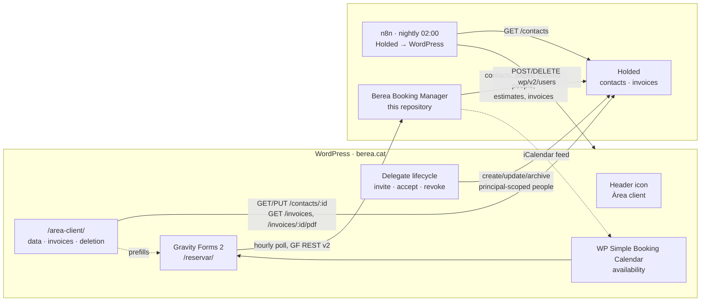

# berea.cat: the WordPress side

Context for anyone working on this application. It describes the systems that sit **upstream** of
Berea Booking Manager: the WordPress site at `berea.cat`, its customer area (*Àrea client*), the
Gravity Forms booking request, and the n8n workflow that keeps WordPress users in step with Holded
contacts.

Nothing here is owned by this repository. It is recorded because the booking request that this
application ingests is produced by these systems, and because two of the decisions below contradict
assumptions written in [`specs/20260909-project-specification/spec.md`](../specs/20260909-project-specification/spec.md).

Source of truth for the code described here: the `funciones-personalizadas` plugin in the
`berea.cat` repository (`funciones-personalizadas/`), deployed to
`/wp-content/plugins/funciones-personalizadas/` on the production host.

## System map



## Stack

| Layer | Technology |
|---|---|
| CMS | WordPress, block theme (full site editing), no classic menus |
| Custom code | `funciones-personalizadas`, a hand-rolled must-use-style plugin, PHP, procedural, no build step |
| Customer area UI | Four dynamic Gutenberg blocks with PHP `render_callback`, registered in `includes/area-client-dades-ui.php` |
| Editor script | One plain-ES5 file, `assets/js/blocks/area-client-dades.js`, no JSX, no bundler |
| Authentication | [Magic Login](https://wordpress.org/plugins/magic-login/) (free tier), passwordless email links |
| Forms | Gravity Forms (booking form is **form ID 2**) |
| Availability | WP Simple Booking Calendar |
| Accounting | Holded API **v2**, `https://api.holded.com/api/v2` |
| Mail | SMTP to `mail.berea.cat:465` (implicit TLS) as `no-reply@berea.cat` |
| Automation | n8n, self-hosted |
| Deployment | FTPS upload of the plugin directory, remote SHA-256 verification |

Prose in the plugin is a deliberate three-language split: identifiers and comments in Spanish,
user-facing strings in Catalan, translator domain `funciones-personalizadas`.

### Required `wp-config.php` constants

| Constant | Purpose |
|---|---|
| `BEREA_HOLDED_TOKEN` | Holded API v2 personal access token, used by the client area for reads and writes |
| `BEREA_SMTP_PASSWORD` | Mailbox password for `no-reply@berea.cat` |

All secrets are absent from the repository. The plugin shows an admin notice when the Holded or SMTP
credential is missing rather than failing silently. Delegate access remains a WordPress operation
when Holded is unavailable; its external projection stays queued until the API recovers.

## Delegation integration runbook

### Ownership and activation

Delegation is always active when the plugin is loaded. WordPress owns the complete lifecycle and
uses the existing `BEREA_HOLDED_TOKEN` directly; there is no Bereius URL, HMAC secret or delegate API
route to configure.

An invitation creates a pending WordPress account and sends a single-use Magic Login link. It does
not create a Holded person. Accepting the invitation first activates WordPress access and then queues
the delegate's current state for Holded. A Holded outage therefore never rolls back accepted access.

For each active generation WordPress creates or recovers an `is_person=true` contact with this exact
`code` marker:

```text
berea-wp-delegate:<principal-holded-id>:<wordpress-user-id>:<generation>
```

The marker is a reverse pointer from the owned person to the fiscal principal. Delegate projection
never reads or writes the principal contact and does not add the person to `contact_persons`.
The Holded person ID and generation are stored in `berea_holded_person_id` and
`berea_holded_person_generation`. An active profile edit updates that verified person. Revocation
invalidates WordPress sessions immediately, then asynchronously archives the managed person.
Reinvitation increments the generation and again creates nothing in Holded until acceptance.

### Safe Holded writes

The marker is both the idempotency key and the ownership boundary. WordPress verifies `is_person`
and the exact marker before updating or archiving a person. During the version-2 migration it also
accepts the exact old same-generation marker, but only for the stored person whose name and email
still match WordPress, then reads back the new marker before completing the queue item.

Holded v2 exposes `custom_id` on reads but ignored it on both contact creation and replacement in
production; writable `code` therefore carries the marker only on these non-fiscal person records.
An owned-person `PUT` sends the canonical WordPress name, email, phone, `is_person` and marker. No
delegate operation performs a fiscal-principal `PUT`: production proved that replacing the shared
contact can erase GET-only provider metadata such as `social_networks` even after a successful 2xx.
An old forward `contact_persons` link is deliberately left untouched and has no role in discovery.

Revocation calls `POST /contacts/bulk-archive` directly with
`{"contact_ids":["person-id"]}` after ownership verification. An isolated production probe on
2026-09-13 proved that `ids` is rejected with HTTP 400 while `contact_ids` is accepted with HTTP
204. Holded continues returning the contact from GET and list calls after that successful archive
and exposes no archive-state field, so HTTP 204 is the API postcondition. The normal Holded People
view no longer listed the disposable person, confirming that the accepted command archived it.

### Queue recovery

WordPress stores at most 100 operations in `berea_delegaciones_holded_cola`, keyed by delegate ID.
WP-Cron processes at most five due delegates every minute. Each run recomputes the current WordPress
state rather than replaying a historical payload, and failures retry with exponential delay capped
at one hour. Count records without dumping the option:

```sh
wp eval '$q = get_option("berea_delegaciones_holded_cola", array()); echo is_array($q) ? count($q) : 0;'
wp cron event list --fields=hook,next_run_gmt,next_run_relative
wp cron event run berea_delegaciones_holded_cron
```

Run the cron command after fixing token, provider availability or contact-shape errors. Logs contain
delegate IDs, attempt counts and error codes but no names or addresses. A projection-version change
queues every active delegate so marker formats can be migrated, plus stale managed people that must
be removed. If 100 entries are ever insufficient, let the queue drain and trigger initialization
again; repeated backfill passes warrant increasing or redesigning the bounded queue.

Bereius has no delegate job. Its quote job scans `/contacts` in 100-row cursor pages before it creates
`EstimateDelivery`. It exact-filters
`berea-wp-delegate:<principal-holded-id>:<delegate-id>:<generation>` locally, then requires each
matching row to be `is_person=true` with a valid email. Unrelated contacts and old markers are
ignored. A malformed matching row, unusable cursor, page failure or exhausted 20-page safety bound
defers delivery and stores no recipients; none is treated as an empty delegate list.

### Unknown estimate delivery

`UNKNOWN` means the request may have reached Holded but Bereius did not receive a definitive result.
It is intentionally terminal for automatic sending:

1. Use the booking warning to locate the estimate, then inspect that estimate's activity in Holded.
  Do not infer failure merely from a timeout in Bereius.
2. If Holded proves the message was accepted, update `EstimateDelivery` to `ACCEPTED` and its related
  `HoldedDocument.sentAt` to the same timestamp in one database transaction.
3. Only if Holded proves it did **not** accept the message, update `EstimateDelivery` to `FAILED` and
  reset that booking's single `booking.quote:<booking id>` job to `PENDING` in the same transaction.
  The retry uses the already frozen To/CC recipients.
4. Record the operator, evidence and affected identifiers in the incident record. If neither outcome
  can be proved, leave `UNKNOWN` unchanged and contact the recipients outside the automated path.

Never invoke Holded `/send` manually for an `UNKNOWN` delivery: that can create the duplicate this
state is designed to prevent.

### Staged rollout

1. Deploy the WordPress plugin and clear opcode cache if changed PHP is not loaded. Confirm
  `BEREA_HOLDED_TOKEN`, the one-minute cron and identifier-only logs.
2. Run initialization/backfill, drain the queue, and verify the existing production delegate
  remains active while its existing person receives the marker for the expected fiscal principal.
  Do not revoke this delegate or remove its stale forward link.
3. Deploy the Bereius migration and application. Confirm the settings page has no WordPress
  integration, the scheduler has no delegate-sync job and read-only Holded discovery finds the
  migrated marker before allowing a controlled estimate.
4. Audit n8n so WordPress writes require role `cliente`, account type `principal` and
  `berea_sync_managed=1`, and Holded reads exclude person contacts.
5. With a disposable delegate, exercise invitation, acceptance, same-person update, direct archive
  and reinvitation generation. The `contact_ids` bulk-archive contract was verified separately with
  an isolated disposable person on 2026-09-13.
6. Send one controlled estimate and confirm the fiscal address is primary, every matching marked
  person is explicit CC, recipients are frozen, and global Holded copy recipients remain disabled.

### Production follow-up

The existing production delegate must be migrated in place; do not create a second Holded person
and do not revoke it. The existing forward link may remain because the new reader ignores it. Its
queue item should be removed only after the person reads back with the new principal-scoped marker
and Bereius discovers it through `/contacts` pagination.

An earlier successful full `PUT` raised concern that the delegate's fiscal principal might have
lost `social_networks` metadata. On 2026-09-13 the operator confirmed that no social-network value
is intended, and the Holded UI showed every supported field empty. No restoration write was made;
never attempt recovery with another v2 full-contact `PUT`.

## The customer identity model

A Berea customer is a Holded contact of `type: client`, mirrored into WordPress as a user.

| WordPress | Value | Notes |
|---|---|---|
| Role | `cliente` | Created on plugin activation, capability `read` only |
| `user_login` | `holded_<holded contact id>` | Never shown to the customer; a Tools page normalises legacy logins with direct `$wpdb` updates because WordPress refuses to rename a login |
| `user_nicename` | same as login | Keeps the public author slug free of personal data |
| `user_email` | Holded `email` | The sign-in identifier, and the only field the customer can change on both sides at once |
| `display_name` / `first_name` / `nickname` | Holded `name` | Holded has no surname field, so all three carry the full name or trade name |

Holded is authoritative. The nightly sync overwrites the WordPress copy, so every customer-facing
edit writes to Holded **first** and only mirrors into user meta after Holded accepts it.

### User meta ↔ Holded contact

Defined centrally in `hcf_get_customer_fields()` and registered for the REST API with
`show_in_rest`, so n8n can write them through `POST /wp-json/wp/v2/users`.

| User meta | Holded contact field | Customer-editable |
|---|---|---|
| `holded_contact_id` | `id` | no (read-only) |
| `holded_name` | `name` | no |
| `holded_vat_number` | **`code`** | no |
| `holded_code` | **`custom_id`** | no |
| `holded_trade_name` | `trade_name` | yes |
| `holded_is_person` | `is_person`, as `"0"` / `"1"` | no |
| `holded_contact_type` | `type` | no |
| `billing_address_1` | `bill_address.address` | yes |
| `billing_city` | `bill_address.city` | yes |
| `billing_postcode` | `bill_address.postal_code` | yes |
| `billing_state` | `bill_address.province` | yes |
| `billing_country` | `bill_address.country_code` | forced to `ES` |
| `billing_phone` | `phone` | yes |
| `holded_mobile` | `mobile` | yes |
| `holded_website` | `website` | yes |
| `holded_tags` | `tags`, comma-joined | no |
| `holded_last_sync` | — | written by n8n, ISO 8601 |
| `user_email` | `email` | yes, changes the sign-in address |

**The tax identifier lives in Holded's `code`, not in `vat_number`.** `custom_id` is the external
reference. This mapping applies to fiscal principal contacts. Managed delegate people are not
fiscal customers, so their `code` is reserved for the `berea-wp-delegate:` ownership marker.

## The customer area

Four pages, all block-rendered, laid out with a sticky sidebar (`berea-area-client-layout`).

| Page | Block | What it does |
|---|---|---|
| `/area-client/` | `berea/dades-facturacio` | Review and edit billing data |
| `/area-client/factures/` | `berea/factures` | Paid invoices from the last two years, PDF download |
| `/area-client/donar-se-de-baixa/` | `berea/sollicitud-baixa` | Request account deletion |
| all of the above | `berea/menu-area-client` | Sidebar navigation, marks the current page with `aria-current` |

Every block degrades to an explanatory message instead of an error when the visitor is signed out or
when the account carries no `holded_contact_id`.

### Sign-in

There is no password anywhere in this flow.

1. A person icon is injected into the `core/navigation` block by filtering `render_block`, because a
   block theme has no classic menu to hook into.
2. Signed out, it opens a modal dialog containing the `[magic_login_form]` shortcode.
3. Magic Login emails a single-use, expiring link. Subject, body and button are overridden through
   `magic_login_email_subject` / `magic_login_email_content` so the plugin can be updated without
   losing the customisation. The body uses `{{DISPLAY_NAME}}`, never `{{USERNAME}}`, because the
   username is `holded_<id>`.
4. `magic_login_redirect` sends anyone with the `cliente` role to `/area-client/` instead of
   `wp-admin/profile.php`.
5. Signed in, the same icon becomes a submenu with *Àrea client* and *Sortir*.

An account only exists if the address is already a Holded client contact. The modal says so, and
points first-time visitors to `/reservar/` instead.

### Editing billing data

`includes/area-client-dades.php`, processed on `template_redirect` so a successful save can
redirect and avoid a POST re-submission.

- Nonce-checked (`check_admin_referer`), then each field sanitised **explicitly by name**. Applying
  a sanitiser through a variable function made the host's antivirus flag the file as a backdoor.
- Holded's `PUT /contacts/:id` **replaces the whole resource**, so the current contact is fetched
  first and the payload rebuilt field by field. Two shapes differ between GET and PUT and are
  converted: `client_record` / `supplier_record` come back as objects but are sent as numbers, and
  `contact_persons` come back expanded but are sent as `{ person_id }`.
- The save is refused outright when the contact carries data the rebuild cannot preserve —
  `custom_id`, `extra_emails`, `group_id`, `notes`, `shipping_addresses`, `rate`,
  `social_networks` — and the customer is told to get in touch. Losing accounting data is worse
  than refusing an edit.
- Changing the email updates the WordPress user first, then Holded; if Holded rejects the change
  the WordPress email is rolled back. Duplicate addresses are rejected before either write.
- Phones are normalised to `[0-9+]` and country forced to `ES` / `España` so the nightly comparison
  does not report a difference on every run.
- Failures are logged to `error_log` with an `[berea-dades]` prefix; the customer sees a generic
  message and never an API detail.

Company name and tax identifier are rendered read-only: they identify the invoices. Correcting them
is a manual, staffed operation through `/contactar/`.

### Invoices

`includes/area-client-factures.php`.

- Lists `GET /invoices` filtered by `contact_id`, `status=completed`, `approval_status=approved`,
  `start_date` two years back, `sort=-date`, with cursor pagination capped at 10 pages and a
  five-minute transient cache.
- Every invoice is re-checked locally before display: 24-hex identifier, `contact_id` compared with
  `hash_equals`, `status === completed`, `payments_pending` within a cent of zero, not a draft, and
  inside the two-year window.
- Download goes through `admin-post.php` with a per-invoice nonce. Ownership is verified **again**
  server-side, then `GET /invoices/:id/pdf` is streamed with `Content-Disposition: attachment`,
  `X-Content-Type-Options: nosniff`, and a `%PDF-` magic-byte check before anything is emitted.

Holded returns monetary amounts with **comma decimals** in production despite the dot-decimal
examples in its documentation, so both formats are normalised before comparison.

### Account deletion

Deliberately not self-service. Submitting the form sets a unique `berea_baixa_solicitada` user meta
(idempotent via `add_user_meta` with `$unique = true`) and emails the site administrator. If the
mail fails the meta is removed, so the request is never recorded as sent when it was not. A human
then processes it. The copy states that invoices and legally retained data stay in the accounting
system.

### Transactional mail

`wp_mail()` is routed through authenticated SMTP because the web host (Vultr) and the mail host
(Raiola) are different machines: without it, messages leave unsigned and the domain's
`p=quarantine` DMARC policy sends them to spam. The `From` is forced to `no-reply@berea.cat`, since
the WordPress default `wordpress@berea.cat` is not a real mailbox.

Notification noise from the sync is suppressed rather than allowed to reach customers:
`rest_pre_insert_user` mutes `wp_mail` for the duration of a `cliente` creation, and the
email-change and password-change notices are filtered off for that role.

### Launch announcement

`assets/email/area-client-clients.html` and `.txt` are the bilingual-safe announcement sent to the
existing customer base, with screenshots embedded as `cid:` attachments. It was delivered by briefly
uploading a token-guarded PHP sender over FTPS, invoking it once over HTTPS, and deleting it —
the same technique used to syntax-check PHP without a local interpreter.

## The n8n sync workflow

**Name**: `Sincronizar contactos de Holded hacía WordPress` · **ID**: `RFreFgVG8yona2tE` · 12 nodes.

Runs on a schedule trigger at **02:00 daily** and reconciles Holded contacts into WordPress users.

```
Schedule 02:00
├─ Get clientes (WordPress)  GET /wp-json/wp/v2/users?roles=cliente&context=edit&per_page=100
│                            page-based pagination, stops when a page returns < 100
│  └─ Normalizar WordPress   (Code) flatten meta, decode HTML entities WordPress adds
│                            to display_name / first_name / nickname
└─ Get contactos (Holded)    GET /api/v2/contacts?limit=100
   │                         cursor pagination, stops on has_more === false
   ├─ Split contactos        items[] → one item per contact
   ├─ Solo clientes          type === 'client'   (v2 has no server-side type filter)
   └─ Normalizar Holded      (Code) replicate WordPress sanitisation, drop contacts
                             without an email, de-duplicate by email

Comparar Holded vs WordPress   (Compare Datasets, key: holded_contact_id, A = Holded, B = WordPress)
├─ In A only    → Crear usuario WP       POST /wp/v2/users
├─ Same         → (not connected)
├─ Different    → Actualizar usuario WP  POST /wp/v2/users/:id
└─ In B only    → Solo huérfanos de Holded → Eliminar usuario WP
                  DELETE /wp/v2/users/:id?force=true&reassign=1
```

Details worth knowing:

- Both `Normalizar` nodes exist purely to make the comparison stable. WordPress HTML-escapes
  `display_name` on save, so `A & B` comes back as `A &amp; B` and every run would otherwise report
  a difference; Holded values are pushed through the same collapse-whitespace and phone-character
  rules that `sanitize_text_field()` and `hcf_sanitize_phone_field()` apply.
- Creation generates a throwaway random password, sets `roles: ['cliente']` and writes
  `holded_last_sync`. The update branch touches email and meta only, never the role.
- Write nodes batch three requests every 1500 ms, retry three times with a five-second wait, and
  `Crear` / `Actualizar` use `onError: continueRegularOutput` so one bad contact cannot abort the run.
- The delete branch is gated by a filter requiring a non-empty `holded_contact_id`, so users created
  by hand in WordPress are never removed.
- Credentials: `WordPressAccountBerea` (application password) and `HoldedAPIBerea`
  (`Authorization: Bearer <PAT>` header credential).

**Current state**: the workflow is **not active**. It has been run on demand. The delete node's own
note says it is disabled for safety, but the node is enabled in the stored definition — verify
before activating.

This workflow is separate from `Crear presupuesto cuando se recibe un formulario de reserva, crear
factura y actualizar contrato` (`cjvh3V6lM0ef260e`), which is the booking automation this
application replaces. The sync workflow is **not** being retired: it has no equivalent here.

## The booking request

Gravity Forms **form 2**, on `/reservar/`, gated by a WP Simple Booking Calendar availability
search. Dates arrive as `wpsbc-search-start-date` and `wpsbc-search-end-date` query parameters in
`Y-n-j` form; the submission is rejected if they are missing, malformed or not in order.

`/reservar/confirmacio/` is a plain page that echoes `nom`, `entrada` and `sortida` query
parameters through the `[nom]`, `[entrada]` and `[sortida]` shortcodes.

### Field identifiers

| ID | Meaning | Source |
|---|---|---|
| 30 | Arrival date | Calendar query parameter |
| 31 | Departure date | Calendar query parameter |
| 47 | Nights | Computed |
| 51 | Service SKU | Computed, `dc`/`pc` + band |
| 52 | Headcount × nights | Computed |
| 61 | First name | Customer / `first_name` |
| 63 | Surname | Customer / `last_name` |
| 64 | Company or legal name | `holded_name` |
| 65 | Tax identifier (NIF/CIF) | `holded_vat_number` |
| 66, 66.2 | Email (with confirmation input) | `user_email` |
| 67 | Phone | `billing_phone`, falling back to `holded_mobile` |
| 68.1 / 68.3 / 68.4 / 68.5 / 68.6 | Address / city / province / postcode / country | `billing_*` |
| 73 | Headcount | Entered |
| 74 | Board type, `dc` or `pc` | Entered |

### Two shapes of submission

This is the single most important consequence for intake in this application.

**Anonymous visitor.** The full form is shown. The tax identifier is validated client-side *and*
server-side with real DNI and CIF checksum algorithms (`gform_field_validation_2_65`).

**Signed-in customer with a linked Holded contact.** `berea_reserva_preparar_formulario` rewrites
the form before render, validation and submission:

- Fields **20, 50, 57, 58, 60, 70, 71, 72 are removed from the form entirely**.
- Fields **30, 31, 61, 63, 64, 65, 66, 67, 68 become `administrative` visibility**, are marked not
  required, and are populated from user meta. `$_POST` is also rewritten on
  `gform_pre_validation_2` and `gform_pre_submission_filter_2`, so the submitted values come from
  the linked Holded contact rather than from the browser.
- The tax-identifier checksum validation is **skipped**, because the value comes from Holded.
- A notice above the form tells the customer their data was filled in automatically and links to the
  customer area.

The entry shape therefore depends on whether the requester was signed in. Mapping by field
identifier — which this application already requires — survives it; mapping by label, presence or
required-ness does not.

### Computed values, and why they cannot be trusted

`populate_admin_field_based_on_conditions` writes on `gform_pre_submission_2`:

```
input_47 = nights
input_51 = board type + headcount band
input_52 = headcount × nights
```

The band in WordPress is `25 / 40 / 60 / 80`, with anything below 25 producing an **empty** SKU. The
specification for this application defines the bands as `30 / 40 / 60 / 80` and applies a 30-place
billing floor. A group of 28 therefore arrives as `pc25` with `input_52 = 28 × nights`, where this
application expects `pc30` with `30 × nights`.

**Treat fields 47, 51 and 52 as advisory.** Recompute nights, SKU and billable units from dates,
headcount and board type at intake. Do not carry the WordPress numbers into a quote.

## What this changes for Berea Booking Manager

1. **The "no customer-facing account area" non-goal is now only true of this application.**
   `berea.cat` has one. Returning customers sign in before they submit, and their submitted identity
   data is a copy of the Holded contact rather than free text. The spec's framing that "requesters
   never sign in" should be read as "requesters never sign in *to this application*".

2. **A large share of requests already have a Holded contact, and it is already correct.** The
   approval path's "look up the contact by tax identifier, create when absent" step will increasingly
   find an exact, recently reviewed match. The lookup still has to happen, because the entry does not
   carry the contact identifier.

3. **Consider asking WordPress to submit `holded_contact_id` in a hidden field.** It would turn a
   fuzzy tax-identifier lookup into an exact join, and it is a one-line addition to
   `berea_reserva_obtener_datos_cliente()`. Open question, not a decision.

4. **Email is not a stable identifier.** Customers can change it from the customer area, which
   rewrites both the WordPress user and the Holded contact. `holded_contact_id` is the stable key.

5. **Creating a Holded contact here has a side effect.** Any contact with `type: client` and an
   email becomes a WordPress user with client-area access on the next nightly run. So a contact
   created by this application during approval must have a correct `type` and a real email address,
   and staff should expect the customer to gain a sign-in they were not explicitly given.

6. **Holded contacts now have two writers.** The customer area writes on save, this application
   writes on approval. Neither locks. Last write wins, and both send the whole contact resource on
   `PUT`, so partial updates are not possible. Anything this application writes to a contact must
   survive being round-tripped through the customer area's rebuild — and vice versa.

7. **The SMTP mailbox is shared infrastructure.** `no-reply@berea.cat` (WordPress) and
   `hola@berea.cat` (this application's booking channel) are mailboxes on the same cPanel mail
   server, under one hourly sending cap and one SPF/DKIM configuration. A change to that server
   affects both.

8. **Availability still lives in WordPress.** The calendar gates the form, and this application
   publishes its iCalendar feed back into the same plugin. The overlap risk documented under
   *Accepted risks* is unchanged by the customer area.

## Open questions

- Should the booking form submit `holded_contact_id` for signed-in customers? (see point 3)
- Should the nightly sync be activated, and should its delete branch be disabled first?
- Should the WordPress service-code bands be corrected to `30 / 40 / 60 / 80`, or left alone on the
  grounds that this application recomputes them anyway?
- Account deletion is handled manually on the WordPress side. If this application ever anonymises a
  customer, nothing revokes the corresponding WordPress user.
