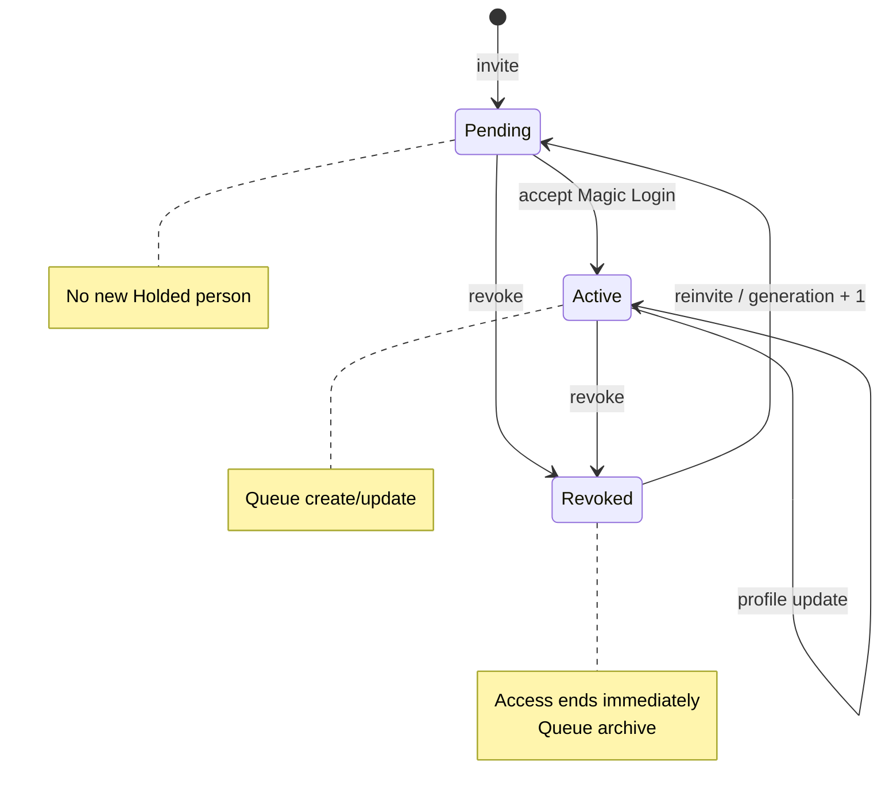
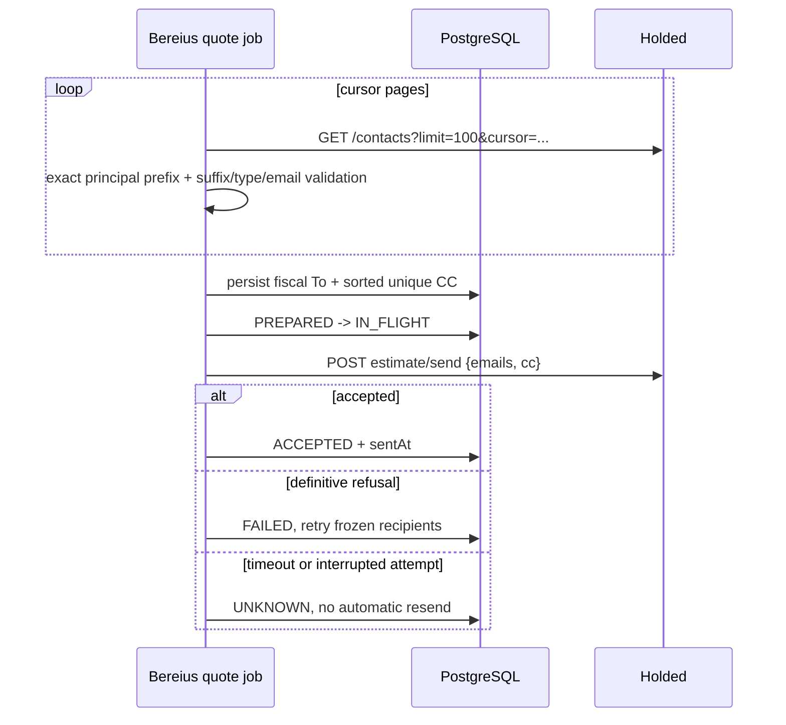

# Implementation Plan: Customer Delegates

**Branch**: `20260912-customer-delegates` | **Date**: 2026-09-12 | **Spec**: [spec.md](./spec.md)

## Summary

Keep delegate authority and Holded projection together in WordPress. Use principal-scoped,
technically marked Holded people as the delivery boundary without changing the shared fiscal
contact. Bereius reads that projection immediately before preparing an estimate delivery, persists
the exact fiscal To and delegate CC recipients, and retains its existing ambiguity-safe delivery
state machine. Booking intake remains pull-only and contains no requester identity.

No WordPress endpoint, HMAC credential, local representative table or delegate synchronization job
exists in Bereius. WordPress access commits independently of Holded availability and its WP-Cron
queue brings the external projection up to date.

## Architecture

### Responsibility split

| Component | Responsibilities | Explicitly does not do |
|---|---|---|
| WordPress | Delegate UI, invitation, acceptance, access, profile, revocation, generation, retry queue, Holded person writes | Call Bereius or wait for Holded before granting/revoking access |
| Holded | Fiscal principal plus principal-scoped marked person projection; estimate mail provider | Decide delegate status or identify the booking requester |
| Bereius | Booking workflow, marked-person reads, recipient freeze, delivery state | Store delegate lifecycle or mutate delegate people |

### WordPress lifecycle

`berea_delegacion_cambiada` remains an in-process WordPress domain hook. The Holded module validates
its event/status pair and enqueues the delegate ID. Queue workers deliberately ignore the original
payload and read current user meta, preventing delayed work from resurrecting stale state.

For an active generation, synchronization searches the technical marker, creates the person only
when absent, records the person ID/generation, and verifies ownership before updates. For non-active
or generation-mismatched state, it verifies ownership, archives the person, and clears metadata only
after success. It never calls the principal contact endpoint for delegate projection.

### Estimate delivery

Discovery fails closed. Bereius cannot distinguish a real empty delegate set from a failed read by
guessing; errors propagate before `EstimateDelivery` exists. Once that row exists its recipients are
immutable for the attempt.

## Data Model

### WordPress user meta

- `berea_principal_user_id`: principal WordPress account.
- `berea_delegation_status`: `pending`, `active` or `revoked`.
- `berea_delegation_generation`: increments when a revoked account is reinvited.
- `berea_delegate_phone`: profile phone.
- `berea_holded_person_id`: current managed Holded person, when one exists.
- `berea_holded_person_generation`: generation represented by that person.

### Holded marker

`berea-wp-delegate:<principal-holded-id>:<wordpress-user-id>:<generation>` is stored in the person's
`code`. It is a reverse pointer plus ownership and eligibility marker, not an authentication
credential. The field is the tax identifier on fiscal contacts, but these person records are not
fiscal customers. For the requested principal, Bereius requires the exact prefix followed by the
suffix `^[1-9]\\d*:[1-9]\\d*$`.

### Bereius

Only `EstimateDelivery` is added for this feature. `CustomerRepresentative`,
`ReceivedDelegateEvent`, `RepresentativeStatus` and `IntegrationProvider.WORDPRESS` are removed by
a forward migration because an earlier local migration had already created them.

## Reliability

- Queue option: `berea_delegaciones_holded_cola`.
- Cron hook: `berea_delegaciones_holded_cron`, scheduled every minute.
- Capacity: 100 unique delegate IDs; five operations per run.
- Retry: current-state reconciliation with exponential delay capped at one hour; no access rollback.
- Backfill version: `berea_delegaciones_holded_backfill`.
- Migration cleanup removes the superseded bridge queue, replay option and cron hook once.
- Projection version 2 requeues every active delegate and safely rewrites the old same-generation
  marker only when the stored person has the expected name and email.
- Delegate projection never writes the principal. Owned person updates send only canonical
  WordPress fields, avoiding replacement loss of Holded-only metadata on the fiscal contact.
- Bereius reads 100 contacts per cursor page. It follows every cursor, rejects missing/repeated
  cursors, and fails closed if the 20-page safety bound is exhausted.

## Security and Privacy

- Principal-only WordPress capability and nonce checks govern delegate mutations.
- Pending/revoked users cannot request Magic Login; revocation destroys tokens and sessions.
- Person updates and removals require the stored ID to resolve to `is_person=true` with the exact
  expected marker.
- Bereius ignores unrelated contacts and trusts no matching managed record until its marker suffix,
  person type and email validate.
- Neither application logs delegate names, emails, phones, raw payloads or API credentials.
- There is no public delegate integration route and no cross-application shared secret.

## Migration and Rollout

**Migration Strategy**: establish and verify the reverse-pointer projection in WordPress before the
new Bereius reader can send an estimate. The Bereius migration is forward-only: it removes obsolete
local projection state and any stale `WORDPRESS` integration row while preserving
`EstimateDelivery`.

**Recovery Strategy**: a WordPress/Holded failure leaves access unchanged and the delegate ID queued
for current-state retry; repair the credential or owned person, then drain the same queue. If the
Bereius migration or healthcheck fails, keep estimate delivery paused, inspect the migrator and app
logs, and recover with a corrective forward migration or a verified database restore rather than
rewriting applied migrations. A failed marker check must be repaired only on the stored,
identity-matching person. An `UNKNOWN` provider send remains terminal until an operator proves the
outcome; recovery must never resend it speculatively.

1. Deploy the WordPress plugin containing `account-delegation-holded.php`; clear opcode cache if the
   host does not detect changed PHP files.
2. Confirm `BEREA_HOLDED_TOKEN` is available and run the plugin's initialization/backfill path.
3. Drain `berea_delegaciones_holded_cron`; inspect counts and identifier-only retry logs.
4. Confirm the existing production delegate is still active and its existing person now carries
  the marker for the expected fiscal principal. Do not use revocation for this live check and do
  not remove the stale forward link.
5. Deploy the Bereius schema/application changes and confirm read-only Holded discovery returns the
  migrated person before allowing a controlled estimate.
6. Verify estimate delivery in a controlled booking: fiscal address in `emails`, matching marked
  delegates in `cc`, and no Holded global-copy configuration.
7. Separately test bulk archival on a disposable delegate before enabling a production revocation
  exercise. Production already confirmed `code` persistence/filtering and that `custom_id` is not
  writable through v2.

## Validation

- WordPress: PHP 8.2 syntax check and `tests/account-delegation-holded-test.php`.
- Bereius: Prisma format/validate/generate, typecheck, lint, delegate recipient and Holded boundary
  unit tests, estimate-delivery and quoting integration tests, full test suite and production build.
- Deployment: queue/backfill inspection, Holded relationship inspection, one controlled estimate,
  and logs checked for PII.

## Residual Risks

- The public Holded documentation confirms `bulk-archive` but not the request body used here.
- `custom_id` cannot be used as the marker because v2 ignores it on writes; tests and readers must
  continue to use the person's `code`.
- A site with more than 100 delegates can need repeated backfill passes; re-enqueueing an existing
  early item resets its attempt counter. This does not affect the current known scale but should be
  changed before approaching queue capacity.
- Revocation takes effect in WordPress immediately, but the Holded projection is eventually
  consistent. Bereius fails closed on lookup errors; a successfully read, not-yet-archived person
  can remain eligible until the queue succeeds.
- An old forward `contact_persons` link can remain on the fiscal contact because removing it would
  require an unsafe full replacement. Bereius ignores that relation entirely.

## Constitution Check

| Principle | Result |
|---|---|
| Portable deployment | No new service, dependency, port or host path |
| Operational ownership | WordPress owns account state and its direct projection; Bereius owns document delivery |
| Secrets | Existing Holded credentials only; retired HMAC secret removed |
| Reliability | Current-state queue, idempotent marker and frozen delivery recipients |
| Privacy | No requester tracking, no local delegate copy, PII-redacted logs |
| Testing | Provider boundaries, lifecycle, retries and delivery ambiguity covered |