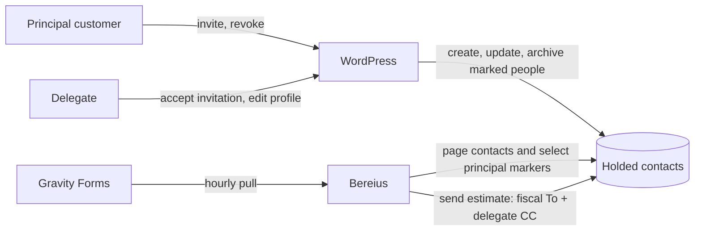

# Feature Specification: Customer Delegates

**Feature Branch**: `20260912-customer-delegates`

**Created**: 2026-09-12

**Status**: Implemented; WordPress projection live, Bereius deployment pending

**Input**: Allow delegates to act for one principal customer and send every estimate to the
principal fiscal email and all active delegates, without tracking who requested the booking.

## System Contract

WordPress is the sole authority for delegate identity, membership and lifecycle. It also owns the
Holded projection: only after a delegate accepts an invitation does WordPress create a separate
Holded person and mark it with
`berea-wp-delegate:<principal-holded-id>:<wordpress-user-id>:<generation>`. The principal ID in the
person's own `code` is a reverse pointer; WordPress never mutates the fiscal contact to establish
the relationship. Pending delegates never appear in Holded. Revocation archives the managed person.

Holded is the integration boundary between WordPress and Bereius. Bereius does not call WordPress,
accept WordPress events or store a delegate directory. Immediately before the first estimate send,
it reads every page of active Holded contacts and includes only valid `is_person=true` contacts
whose exact technical marker points back to that principal. It then freezes the fiscal primary
address and the delegate CC list in `EstimateDelivery`.

## User Scenarios

### 1. Delegate lifecycle

1. A principal invites a delegate. WordPress creates a pending delegate account and sends a
   single-use Magic Login invitation. No Holded person is created.
2. The delegate accepts. WordPress grants active access and queues the current delegate state for
   Holded synchronization. Access remains active even if Holded is unavailable.
3. WordPress creates or recovers the person for the current generation, stores its Holded ID on
  the delegate and writes the principal-scoped marker on that person only. The fiscal contact is
  neither read nor written by this projection.
4. An active delegate changes name, email or phone. WordPress queues an update of that same marked
   person.
5. A principal revokes a delegate. WordPress invalidates sessions and Magic Login immediately,
  then queues archival. A reinvitation increments the generation and creates no new Holded person
  until the new invitation is accepted.

### 2. Estimate delivery

1. Bereius imports the booking from Gravity Forms without requester, delegate or author identity.
2. Approval creates or resolves the principal fiscal contact and creates the estimate and reserve
   invoice.
3. Before the estimate's first delivery attempt, Bereius follows the cursor on `/contacts` until it
  reaches the end and locally selects the exact
  `berea-wp-delegate:<principal-holded-id>:` prefix.
4. Only contacts with a numeric delegate/generation suffix, `is_person=true` and a valid email are
  eligible. A malformed contact under the requested principal's managed prefix fails closed.
5. The fiscal email is `emails[0]`; normalized, unique delegate addresses are explicit `cc` values.
   A delegate address equal to the fiscal address is removed from CC.
6. The exact recipients are persisted before `/estimates/:id/send`. They do not change on retries
   of that delivery attempt.

## Functional Requirements

- **FR-001**: WordPress MUST remain the sole authority for delegate membership and status.
- **FR-002**: Delegation MUST always be enabled while the plugin is active.
- **FR-003**: A pending or reinvited-pending delegate MUST NOT have a new Holded person.
- **FR-004**: Acceptance MUST enqueue creation or recovery of an `is_person=true` Holded contact
  marked `berea-wp-delegate:<principal-holded-id>:<delegate-id>:<generation>` without writing the
  principal contact.
- **FR-005**: Updates within one generation MUST reuse the same verified Holded person.
- **FR-006**: Revocation MUST invalidate WordPress access immediately, then asynchronously archive
  only the verified managed person.
- **FR-007**: A Holded failure MUST NOT roll back or disable WordPress access. Synchronization MUST
  retry from current WordPress state rather than replaying stale payloads.
- **FR-008**: Existing active delegates MUST be recoverable through a one-time backfill.
- **FR-009**: Delegate projection MUST never replace the fiscal principal contact. WordPress MAY
  replace only the person it owns, using its canonical name, email, phone, type and marker.
- **FR-010**: Bereius MUST NOT expose a delegate event endpoint, call WordPress, hold WordPress
  credentials or persist delegate lifecycle state.
- **FR-011**: Bereius MUST discover delegates exclusively by completing Holded contact cursor
  pagination, exact-filtering the principal-scoped marker locally and validating type and email.
- **FR-012**: Any failed or malformed Holded delegate lookup MUST defer delivery and MUST NOT be
  interpreted as an empty delegate list.
- **FR-013**: Every estimate MUST target the principal fiscal email as primary and every unique
  eligible delegate as explicit CC.
- **FR-014**: Bereius MUST NOT store who requested a booking or use requester identity to choose
  recipients.
- **FR-015**: The exact normalized recipient set MUST be persisted before external delivery.
- **FR-016**: Accepted delivery MUST never be repeated automatically. An ambiguous provider outcome
  MUST enter `UNKNOWN` and require operator resolution.
- **FR-017**: Holded global/default copy recipients MUST remain disabled. Delegate copies apply to
  estimates only; invoice and booking-email recipients remain unchanged.
- **FR-018**: Logs MUST use technical identifiers, counts and error codes, never delegate PII,
  provider payloads or credentials.

## Data Ownership

| Data | Authority | Stored by |
|---|---|---|
| Delegate account, principal relation, status and generation | WordPress | WordPress user/meta |
| Managed person ID and generation | WordPress | `berea_holded_person_id`, `berea_holded_person_generation` |
| Fiscal customer | Holded | Principal contact |
| Delivery projection | WordPress | Principal-scoped marked Holded person |
| Booking requester | Not collected | Nowhere |
| Frozen estimate recipients and send state | Bereius | `EstimateDelivery` |

## Failure and Recovery Rules

- The WordPress option queue is keyed by delegate ID, capped at 100 entries and drains at most five
  due entries per minute. Re-enqueueing replaces the item, so execution always recomputes current
  WordPress state. Failures use bounded exponential delay capped at one hour.
- A projection-version change makes the one-time backfill queue every active delegate so old marker
  formats are migrated; it also queues revoked or pending delegates with a stored person to remove.
- If the queue is full, the operation is logged and the backfill remains incomplete so a later
  request can retry discovery. Sites approaching 100 delegates require an operational review.
- Bereius persists no `EstimateDelivery` row until the complete contact scan and recipient
  validation succeed. A later retry therefore performs a fresh discovery.
- Once recipients are frozen, a definitive provider refusal may retry the same set. A timeout or an
  interrupted `IN_FLIGHT` attempt becomes `UNKNOWN` and is never resent automatically.

## Security & Privacy Implications

- WordPress copies only the active delegate's name, email and optional phone into its managed
  Holded person. Bereius stores no delegate directory or booking requester identity, but the frozen
  delivery record retains recipient addresses for audit and duplicate-send prevention.
- Delegate lifecycle actions remain nonce-protected and principal-only. Updates and archival require
  the stored person ID, generation, `is_person=true` and exact ownership marker; migration of an old
  marker additionally requires the canonical WordPress name and email to match.
- Holded and WordPress credentials remain server-side, encrypted where Bereius persists them, and
  excluded from logs and provider error messages. Production probes must use short-lived tokens and
  be removed immediately after use.
- Bereius fails closed when pagination, marker shape, person type or email validation is uncertain.
  It never mutates the fiscal principal for delegate discovery or projection.
- Explicit CC delivery makes delegate addresses visible to the fiscal recipient and to other active
  delegates on the same estimate. This is an intentional product requirement; principals control
  membership, and revocation removes the person from future discovery but not from frozen historical
  delivery records.
- The marker is an ownership and routing convention, not a cryptographic proof. Anyone with write
  access to the shared Holded account could forge one and redirect a copy, so Holded write access and
  both API credentials are privileged administrative capabilities that require independent access
  control and rotation after compromise.

## Threats & Abuse Cases

- A customer attempting to manage another principal's delegates is rejected by WordPress ownership
  checks before any lifecycle change or Holded operation; state-changing requests also require a
  valid nonce and are subject to the existing invitation limits.
- A forged or malformed Holded marker cannot broaden WordPress access. Bereius accepts only the
  exact requested principal prefix and valid suffix/type/email shape, but a forged valid marker by a
  privileged Holded writer could still receive future estimate copies; audit and rotate compromised
  Holded credentials immediately.
- Replayed quote jobs cannot rediscover a more favorable recipient list after preparation. The
  immutable snapshot and delivery states prevent automatic duplicate sends, and an uncertain send
  is parked as `UNKNOWN` for human evidence-based resolution.
- Revocation ends WordPress access synchronously, while removal from Holded is asynchronous. Until
  the queue successfully archives that person, a concurrent new estimate could still discover the
  old address; operators must clear failed revocation items before sending a time-sensitive estimate.
- Oversized contact collections, cursor loops and malformed matching people are treated as provider
  failures rather than as zero delegates, preventing silent privacy or delivery-policy downgrade.

## Acceptance Criteria

- Pending invitation: zero Holded writes.
- First acceptance: one principal-scoped marked person is created or recovered; the fiscal contact
  receives no request.
- Active profile update: the same person ID is updated; no duplicate is created.
- Revocation: WordPress access ends immediately; the verified person is archived directly.
- Reinvitation: generation increases; no person appears until acceptance; acceptance creates a new
  generation marker.
- Backfill: an existing active delegate is projected without changing access.
- Holded outage: access remains active and the queued operation remains retryable.
- Estimate delivery: fiscal To plus all matching principal-scoped people in deterministic CC, with
  duplicates removed and no requester dependency.
- Malformed matching managed person or incomplete pagination: delivery fails closed before
  recipients are persisted.
- Accepted and ambiguous sends: no automatic duplicate delivery.

## Non-Goals

- Sending invoices or general booking notifications to delegates.
- Recording which principal or delegate submitted a booking.
- Allowing Bereius to create, invite, edit or revoke delegates.
- Synchronizing delegate lifecycle into Bereius or exposing a WordPress/Bereius bridge.
- Using Holded global copy-recipient settings.

## Deployment Conditions

- WordPress needs only `BEREA_HOLDED_TOKEN`; no Bereius URL or delegate HMAC secret is used.
- Before relying on production revocation, verify the Holded
  `POST /contacts/bulk-archive` body against a disposable managed person. The implementation sends
  `{ "ids": ["person-id"] }`.
- Production validation proved that contact `custom_id` is not writable through v2. The delegate
  marker therefore uses the writable `code` field on non-fiscal person records.
- After deploying the plugin, run the one-time backfill and confirm the existing production
  delegate carries the marker for the expected fiscal principal. Do not revoke this delegate as
  part of validation, and leave its stale forward link untouched.