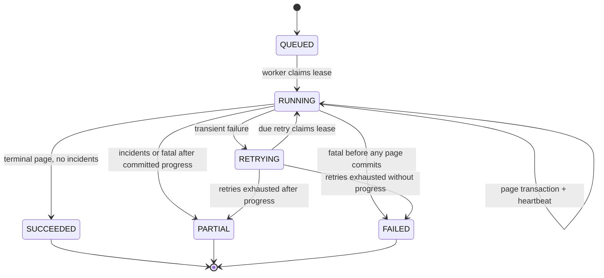

# Data Model: Holded Bank Movements

## Design Principles

- Holded remains authoritative for movement content and status; Bereius stores a minimal read model.
- Provider payloads are converted into domain values before persistence and are never stored whole.
- Money uses signed integer minor units. Dates are bank calendar dates, not timezone-sensitive
  instants.
- Account-scoped provider identity, page-transaction checkpoints, and database constraints provide
  idempotency and crash recovery.
- A booking changes state only through the existing booking lifecycle service and only after an
  operator confirms a proposal.

## Enumerations

### `BankMovementDirection`

| Value | Meaning |
|---|---|
| `INCOME` | Money entering the configured treasury account; persisted amount is positive. |
| `EXPENSE` | Money leaving the configured treasury account; persisted amount is negative. |

No accounting category is represented by this enum.

### `BankSyncTrigger`

| Value | Meaning |
|---|---|
| `SCHEDULED` | Normal six-hour account synchronization. |
| `MANUAL` | An operator or administrator requested an immediate refresh. |
| `EXPIRY` | A final freshness check required before expiring unpaid bookings. |

### `BankSyncStatus`

| Value | Meaning |
|---|---|
| `QUEUED` | Durable work exists but has not acquired a lease. |
| `RUNNING` | A worker owns an unexpired lease and is processing a page. |
| `RETRYING` | A transient failure occurred and the same run is waiting for another attempt. |
| `SUCCEEDED` | The terminal page was committed with no incidents. |
| `PARTIAL` | Some page progress was retained but the run ended before exhaustion, or the terminal page was reached with incidents. |
| `FAILED` | The run ended without committing any provider page. |

`QUEUED`, `RUNNING`, and `RETRYING` are nonterminal. All other values are terminal.

### `BankSyncIncidentCode`

The stored taxonomy is deliberately non-personal:

- `PROVIDER_UNAUTHORIZED`
- `PROVIDER_NOT_FOUND`
- `PROVIDER_RATE_LIMITED`
- `PROVIDER_UNAVAILABLE`
- `PROVIDER_REQUEST_REJECTED`
- `RESPONSE_TOO_LARGE`
- `MALFORMED_PAGE`
- `MISSING_CURSOR`
- `REPEATED_CURSOR`
- `INVALID_MOVEMENT_ID`
- `ACCOUNT_MISMATCH`
- `INVALID_BOOKING_DATE`
- `INVALID_VALUE_DATE`
- `INVALID_AMOUNT`
- `ZERO_AMOUNT`
- `INVALID_CURRENCY`
- `DESCRIPTION_TOO_LONG`
- `CONFIRMED_MATCH_CHANGED`

No incident stores a provider body, narrative, counterparty, bank reference, amount, cursor, or
credential.

### `BankReconciliationStatus`

| Value | Meaning |
|---|---|
| `PENDING` | Candidate awaits a human decision. |
| `CONFIRMED` | An operator created the linked payment and confirmed the booking. |
| `DISMISSED` | An operator rejected the candidate. |
| `INVALIDATED` | A later movement/booking change made an unconfirmed proposal ineligible. |

## Entities

### `HoldedTreasuryAccount`

Minimal configuration and synchronization schedule for a treasury account. It never stores the
provider's account number, IBAN, BIC, institution, balance, or complete account response.

| Field | Type | Required | Rules |
|---|---|---:|---|
| `id` | String | yes | Local cuid primary key. |
| `holdedAccountId` | String | yes | Unique, exactly 24 hexadecimal characters; never logged. |
| `displayName` | String | yes | Trimmed provider name, 1-140 characters; never logged. |
| `currency` | String | yes | Uppercase three-letter code; only observed `EUR` accounts are initially eligible. |
| `importStartDate` | Date | yes | UTC calendar date, no future value; immutable after first run is queued. |
| `retentionFloorDate` | Date? | no | Monotonic normal-scan lower bound; null until the first clean complete scan. |
| `active` | Boolean | yes | Exactly one row may be active. |
| `configuredById` | String? | no | Administrator user; `SET NULL` if that user is deleted. |
| `nextScheduledAt` | DateTime | yes | Next six-hour synchronization due time. |
| `lastAttemptAt` | DateTime? | no | Start time of the latest run for display/freshness. |
| `lastSuccessfulAt` | DateTime? | no | Finish time of the latest `SUCCEEDED` run only. |
| `createdAt` | DateTime | yes | Creation timestamp. |
| `updatedAt` | DateTime | yes | Last configuration/state update. |

**Relations**:

- many `BankMovement`
- many `BankSyncRun`
- optional configuring `User`

**Database constraints/indexes**:

- unique `holdedAccountId`
- partial unique index allowing only one row where `active = true`
- index on `(active, nextScheduledAt)` for due scheduling

**Lifecycle**:

1. The administrator selects a non-archived account returned by Holded.
2. The service upserts its minimal account row and deactivates the previous row transactionally.
3. The first run locks `importStartDate` for that provider account.
4. After clean exhaustion, retention may advance `retentionFloorDate` but never move it backward or
  beyond 90 calendar days before the cleanup date.
5. Deactivation stops future scheduled runs but does not immediately delete movements, runs, or
  proposals; the normal retention policy still applies.
6. Reselecting a historical account reuses its locked import date and retention floor.

### `BankMovement`

Current minimal local projection of one movement.

| Field | Type | Required | Rules |
|---|---|---:|---|
| `id` | String | yes | Local cuid primary key. |
| `accountId` | String | yes | FK to `HoldedTreasuryAccount`, `RESTRICT` on delete. |
| `holdedMovementId` | String | yes | Exactly 24 hexadecimal characters. |
| `bookingDate` | Date | yes | Valid `YYYY-MM-DD` calendar portion of observed `booking_date`. |
| `valueDate` | Date? | no | Valid calendar portion of `value_date` when present. |
| `narrative` | Text? | no | Trimmed observed `description`, maximum 2,000 characters. |
| `amountMinor` | BigInt | yes | Exact signed minor units; never zero. |
| `currency` | String | yes | Uppercase three-letter code; provider ingestion initially accepts only `EUR`. |
| `providerStatus` | String? | no | Trimmed provider status, maximum 64 characters. |
| `direction` | `BankMovementDirection` | yes | Determined only by the signed amount under the verified contract. |
| `firstSeenAt` | DateTime | yes | First successful import timestamp; immutable. |
| `lastSeenAt` | DateTime | yes | Latest run that observed the movement. |
| `createdAt` | DateTime | yes | Local creation timestamp. |
| `updatedAt` | DateTime | yes | Local update timestamp. |

**Observed-provider mapping**:

| Holded field | Domain field/use | Persisted? |
|---|---|---:|
| `id` | `holdedMovementId` | yes |
| `banking_account_id` | Validate requested account, then relation `accountId` | yes, via relation |
| `booking_date` | `bookingDate` | yes |
| `value_date` | `valueDate` | yes when present |
| `description` | `narrative`; concept and matching-reference projection | yes when present |
| `amount` | exact `amountMinor` and sign classification | yes |
| `currency` | `currency` | yes |
| `status` | `providerStatus` | yes when present |
| `accounting_amount`, `accounting_currency` | none | no |
| `balance`, `flagged_at`, `note`, `origin`, `reconciled_amount` | none | no |
| unknown fields | none | no |

The current contract exposes no separate reference or counterparty. API/UI projections therefore
return `concept = narrative`, `reference = narrative`, and `counterparty = null` without duplicating
or parsing the narrative in storage.

**Database constraints/indexes**:

- unique `(accountId, holdedMovementId)` is the provider idempotency key
- check `amountMinor <> 0`
- check direction/sign consistency:
  - `INCOME` requires `amountMinor > 0`
  - `EXPENSE` requires `amountMinor < 0`
- check currency shape `^[A-Z]{3}$`
- index `(bookingDate DESC, holdedMovementId)` for default order
- index `(accountId, bookingDate DESC)`
- index `(direction, bookingDate DESC)`
- index `(currency, bookingDate DESC)`

Text `contains` filtering is intentionally unindexed at the observed scale. Revisit a trigram index
only from measured query evidence; do not add an extension preemptively.

**Upsert behavior**:

- On first sight: create with equal `firstSeenAt` and `lastSeenAt`.
- On repeat: update every retained mutable provider field and `lastSeenAt`, preserving local ID and
  `firstSeenAt`.
- If values are unchanged: update only `lastSeenAt` and increment the run's unchanged counter.
- Never delete a movement merely because a later provider page or run fails.

### `BankSyncRun`

Durable request, queue item, lease, checkpoint, retry state, and user-visible progress record.

| Field | Type | Required | Rules |
|---|---|---:|---|
| `id` | String | yes | Local cuid primary key; safe to expose to authorized UI. |
| `accountId` | String | yes | FK to treasury account, `RESTRICT` on delete. |
| `trigger` | `BankSyncTrigger` | yes | Scheduled, manual, or pre-expiry. |
| `status` | `BankSyncStatus` | yes | Starts `QUEUED`. |
| `requestedById` | String? | no | Manual actor; null for system runs, `SET NULL` on user deletion. |
| `resumedFromRunId` | String? | no | Prior terminal partial/failed run supplying a safe cursor. |
| `windowStartDate` | Date | yes | Immutable `start_date` used for every page: configured date for the first run, then the greater of that date and the committed retention floor. |
| `nextCursor` | Text? | no | Opaque cursor for the next uncommitted page; never logged/exposed. |
| `lastProcessedMovementId` | String? | no | Last validated technical ID on the last committed page; not shown. |
| `pageCount` | Integer | yes | Successfully committed pages, default 0. |
| `itemCount` | Integer | yes | Provider items resolved, default 0. |
| `insertedCount` | Integer | yes | New movements, default 0. |
| `updatedCount` | Integer | yes | Changed movements, default 0. |
| `unchangedCount` | Integer | yes | Existing unchanged movements, default 0. |
| `incidentCount` | Integer | yes | Sanitized incidents, default 0. |
| `attemptCount` | Integer | yes | Lease attempts, default 0. |
| `nextAttemptAt` | DateTime | yes | Queue/retry availability time. |
| `leaseToken` | String? | no | Random worker ownership token, cleared at terminal state. |
| `leaseExpiresAt` | DateTime? | no | Reclaim boundary for a crashed worker. |
| `heartbeatAt` | DateTime? | no | Updated after each committed page. |
| `failureCode` | `BankSyncIncidentCode`? | no | Latest sanitized run-level failure. |
| `startedAt` | DateTime? | no | First acquired lease. |
| `exhaustedAt` | DateTime? | no | Set only when the committed provider page has `has_more=false`, including an incident-only `PARTIAL` result. |
| `finishedAt` | DateTime? | no | Terminal transition timestamp. |
| `createdAt` | DateTime | yes | Request timestamp. |
| `updatedAt` | DateTime | yes | Latest progress/state change. |

**Relations**:

- treasury account
- requesting user
- optional prior run (`resumedFromRunId`)
- many `BankSyncIncident`

The prior-run relation uses `SET NULL` on delete so terminal operational history can be pruned after
its audit window without deleting or blocking a newer run.

**Database constraints/indexes**:

- all counters are non-negative
- partial unique index on `accountId` for statuses `QUEUED`, `RUNNING`, `RETRYING`
- index `(status, nextAttemptAt)` for worker claims
- index `(accountId, createdAt DESC)` for latest status/history
- conditional claim/heartbeat updates include the current lease token and expected state

**State transitions**:

A manual retry creates a new `QUEUED` row linked through `resumedFromRunId`. It copies a safe
nonterminal cursor only when one exists; otherwise it starts the configured window from page one.

### `BankSyncIncident`

Sanitized, operator-visible evidence that part of a run could not be accepted.

| Field | Type | Required | Rules |
|---|---|---:|---|
| `id` | String | yes | Local cuid primary key. |
| `runId` | String | yes | FK to run, `CASCADE` only when operational run history is pruned. |
| `code` | `BankSyncIncidentCode` | yes | Stable localized category. |
| `pageNumber` | Integer | yes | One-based provider page position, at least 1. |
| `itemIndex` | Integer? | no | Zero-based non-negative item position when the page parsed. |
| `holdedMovementId` | String? | no | Set only after the ID itself passes validation. Never logged. |
| `createdAt` | DateTime | yes | Incident timestamp. |

There is no free-text provider message or payload column. UI copy is selected from localized message
catalogs by `code`.

**Database constraints**:

- check `pageNumber >= 1`
- check `itemIndex IS NULL OR itemIndex >= 0`

### `BankReconciliationProposal`

Persisted operator decision around one candidate movement and booking.

| Field | Type | Required | Rules |
|---|---|---:|---|
| `id` | String | yes | Local cuid primary key. |
| `movementId` | String | yes | FK to movement, `RESTRICT` on delete. |
| `bookingRequestId` | String | yes | FK to booking, `RESTRICT` on delete. |
| `status` | `BankReconciliationStatus` | yes | Starts `PENDING`. |
| `decidedById` | String? | no | Operator for confirm/dismiss, `SET NULL` on user deletion. |
| `decidedAt` | DateTime? | no | Human decision timestamp. |
| `invalidatedAt` | DateTime? | no | Automatic eligibility-loss timestamp. |
| `invalidationCode` | String? | no | Stable non-personal reason, maximum 64 characters. |
| `createdAt` | DateTime | yes | Proposal timestamp. |
| `updatedAt` | DateTime | yes | Last state change. |

**Database constraints/indexes**:

- unique `(movementId, bookingRequestId)` prevents regeneration after repeat scans
- index `(status, createdAt DESC)` for operator review
- index `(bookingRequestId, status)` for booking details
- a movement may have historical proposals, but the confirmation transaction and unique payment
  relation allow it to fund at most one booking

**Eligibility invariant for `PENDING`**:

- movement is `INCOME` and positive;
- movement currency equals the booking currency (`EUR` in the current booking model);
- booking state is `AWAITING_PAYMENT`;
- the booking has an estimate `documentNumber` and the movement narrative contains it literally;
- movement minor units equal `advanceCents + depositCents` exactly.

### Existing `Payment` Extension

Add one nullable field and relation:

| Field | Type | Required | Rules |
|---|---|---:|---|
| `bankMovementId` | String? | no | Unique FK to `BankMovement`, `RESTRICT` while the payment is retained. |

Existing manually recorded payments keep `bankMovementId = null`. A confirmed proposal writes the
positive movement amount into existing `amountCents`, copies the single narrative into the existing
nullable payment reference for audit, and sets `bankMovementId`.

## Atomic Workflows

### Configure Active Account

One transaction:

1. Validate administrator and provider-selected account before entering the transaction.
2. Lock account configuration rows.
3. Deactivate the current account.
4. Create/reselect the chosen account without changing a locked historical `importStartDate`.
5. Mark it active, set `nextScheduledAt` to now, and record `configuredById`.

Failure changes nothing.

### Commit a Movement Page

One short transaction per page:

1. Assert run is `RUNNING`, lease token matches, and lease has not expired.
2. Upsert all valid movements by `(accountId, holdedMovementId)`.
3. Add sanitized incidents for invalid items.
4. Reconcile pending proposal eligibility and create exact new candidates.
5. Increment counters and set the last processed technical ID.
6. Store the next cursor and renew heartbeat/lease, or transition terminally when `has_more=false`.

No cursor advances if any database operation fails.

### Confirm a Proposal

One transaction:

1. Read the proposal, movement, booking totals/state, and estimate number.
2. Re-evaluate every eligibility invariant against current rows.
3. Condition the proposal update on `status=PENDING`.
4. Create one `Payment` with unique `bankMovementId`.
5. Mark the selected proposal `CONFIRMED` and invalidate sibling pending proposals.
6. Call `transitionBooking(..., transaction)` from `AWAITING_PAYMENT` to `CONFIRMED`, producing the
   existing booking audit event with the operator ID.

Queue the existing confirmation email only after commit. A stale proposal, changed booking, reused
movement, or amount/reference mismatch fails without a partial payment or state transition.

## Retention and Deletion

- Raw Holded account/movement responses never enter persistent storage.
- Provider account rows and movements use restrictive relations so account switching or a failed
  deployment cannot cascade-delete imported financial data.
- The first scan uses `importStartDate`. After a run with `exhaustedAt` set commits every page from
  the current lower bound, the daily cleanup may atomically advance `retentionFloorDate` to the later
  of its current value and the UTC date 90 calendar days earlier. An incomplete partial, failed,
  retrying, or unleased run cannot authorize advancement. An exhausted `PARTIAL` run caused only by
  item incidents may authorize it because no provider page remains unread.
- Once the floor advances, dismissed/invalidated proposals for older movements are deleted before
  deleting movements whose `bookingDate` is older than the floor and that have neither a payment nor
  a `PENDING`/`CONFIRMED` proposal. This makes unmatched third-party data the shortest-lived banking
  record and prevents the next normal scan from re-importing it.
- Payment-linked movements and movements with pending or confirmed proposals remain protected by
  restrictive relations and follow the associated booking/payment retention lifecycle. A future
  parent-record retention operation must release those links explicitly before banking cleanup can
  remove the movement.
- Terminal runs older than 90 days are deleted in bounded batches. Their incidents cascade and any
  newer `resumedFromRunId` link becomes null; nonterminal runs and movements never cascade.
- This feature introduces no destructive backfill or immediate cleanup during migration.

### Advance Retention and Prune

One bounded transaction per account:

1. Lock the account and calculate the candidate UTC floor (`cleanup date - 90 calendar days`).
2. Require a terminal run with `exhaustedAt` set whose immutable window began at or before the
  current floor (or `importStartDate` while the floor is null); otherwise leave the floor and rows
  unchanged.
3. Advance the floor monotonically.
4. Delete old dismissed/invalidated proposals, then old movements with no protected proposal or
   payment relation.

Run/incident pruning is a separate bounded transaction so it cannot roll back or delay movement
retention. Cleanup is idempotent and performs no Holded request.

## Migration and Compatibility

The forward migration:

1. creates the five enums and five new models, including the account retention floor;
2. adds nullable `Payment.bankMovementId`;
3. creates foreign keys, ordinary indexes, compound uniqueness, sign/currency checks, and partial
   unique indexes for one active account and one active run per account; and
4. leaves every existing row valid without a data backfill.

The currently deployed application ignores the additive tables/column, so migration-first rollout
is compatible. A code rollback does not remove the schema or imported data. Any schema correction is
a new forward migration; normal database backup/restore remains the recovery boundary.