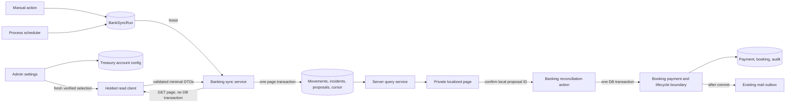

# Implementation Plan: Holded Bank Movements

**Branch**: `20260916-holded-bank-movements` | **Date**: 2026-09-16 | **Spec**: [spec.md](./spec.md)

**Input**: Feature specification from
`/specs/20260916-holded-bank-movements/spec.md`

## Summary

Add a private, localized banking console backed only by Holded's read-only treasury movements.
Bereius stores a minimal account-scoped movement projection, scans a 14-day overlap every six hours
and the complete retained window at least daily through verified opaque-cursor pagination, and
exposes exact server-side filters and per-currency totals.

Synchronization uses `BankSyncRun` as a PostgreSQL-backed queue, lease, retry record, and page
checkpoint. The existing application scheduler claims this work; no new worker container, package,
secret, public endpoint, or provider write is introduced. Exact income/reference/amount candidates
become persisted proposals, but only an operator confirmation atomically creates an existing
`Payment`, invokes the authoritative booking lifecycle/audit boundary, and queues confirmation mail.
After proven page exhaustion, the same scheduler advances a 90-day retention floor and prunes only
old unmatched data that no retained proposal or payment protects.

## Technical Context

**Language/Version**: TypeScript 6.0.x on Node.js 24 LTS

**Package Manager**: pnpm 11.22.0

**Primary Dependencies**: Next.js 16.3.5 App Router, React 19.3, Tailwind CSS 4, Prisma 7.10,
PostgreSQL, Zod 4, Auth.js/NextAuth 4, next-intl 4, Pino 10, native `fetch` and `Intl`; no new
dependency

**Storage**: PostgreSQL via Prisma. Five new banking models, five enums, an account retention floor,
additive nullable unique `Payment.bankMovementId`, SQL check constraints, and partial unique indexes

**Testing**: Vitest 4 with jsdom/Testing Library for unit/components; Vitest integration tests against
real PostgreSQL for migration, leases, page transactions, concurrency, payment/state/audit
atomicity, expiry, and retention; Playwright 1.63 against the production standalone artifact for
role, locale, UI, metadata, responsive, outage isolation, health separation, and critical
reconciliation flows. Holded is mocked by extending the existing loopback provider fixture and
server-process `fetch` preload with synthetic responses

**Target Platform**: Existing Docker Linux container on Raspberry Pi ARM64, portable to VPS;
Cloudflare Tunnel -> Traefik ingress

**Project Type**: Existing single Next.js full-stack application container plus PostgreSQL and the
one-shot migration service

**Deployment**: Existing Docker Compose files, networks, ports, healthcheck, named volume, and
`restart: unless-stopped`; no deployment topology change

**CI/CD**: Existing GitHub Actions/self-hosted runner quality and deployment paths

**Secrets**: Reuse the encrypted `IntegrationSettings` credential for `HOLDED`. No new environment
variable, credential copy, URL token, fixture secret, or production `.env`

**Observability**: Existing Pino JSON stdout logger and Docker rotation. Add run lifecycle,
duration/freshness, page/item/upsert/incident/retry counters, and sanitized reason codes. Exclude
provider account/movement IDs, cursors, dates, amounts, narratives, references, counterparties,
filters, bodies, authorization values, and provider messages. Stale/failed banking is an authorized
UI and structured integration-degradation signal; it does not change application/PostgreSQL
readiness or make the existing `/api/health` endpoint fail. Degraded means a latest
`RETRYING`/`PARTIAL`/`FAILED` run, or no active run with no successful synchronization or a latest
success older than six hours; unconfigured and initial active-run states remain distinct

**Migration Strategy**: Migration-first, forward-only, and additive. Create banking enums/tables,
relations, checks, indexes, and nullable `Payment.bankMovementId` without rewriting existing rows.
Prisma models express ordinary relations/indexes; migration SQL owns PostgreSQL partial unique and
check constraints. Deploy compatible application code after the one-shot migrator succeeds. Any
schema correction is a new forward migration

**Recovery Strategy**: Take and verify the normal logical backup before production migration. A
code rollback leaves the additive schema and imported records intact. Provider/process failures
resume from the last page transaction through an expiring lease; stale rejected cursors restart the
retained window idempotently. Never delete movement history outside the specified retention policy
or rewrite an applied migration to recover. Restore the whole database only when forward repair
cannot preserve correctness

**Performance Goals**: Attempt scheduled synchronization at least every six hours with a 14-day
overlap after a full scan less than 24 hours old; complete at least one retained-window scan daily;
expose an accepted manual refresh result within two minutes under normal Holded availability; fetch
at most 100 provider items per request; perform no external I/O inside database transactions; return
50 movement rows per page; calculate filtered totals in PostgreSQL without loading the complete set
into application or browser memory; and support the repeatable under-one-minute movement-finding
scenario without client-side bulk loading

**Constraints**: Holded is read-only and its verified movement endpoint has no update timestamp,
direction field, separate reference, or counterparty. Every run must therefore rescan its frozen
effective `start_date`; routine scheduled runs use a 14-day overlap only after recent complete
full-window evidence, while initial, daily full, manual, retry, and expiry runs use the retained
floor. All runs classify by exact signed amount and project the one description as
concept/reference. Initial ingestion accepts only the evidenced two-decimal `EUR` representation;
non-200 bodies are opaque and error categories use transport/status only. Amounts use BigInt minor
units, bank dates use `@db.Date`, only one treasury account is active, and only one run per account
may be nonterminal. Provider bodies and errors are bounded and discarded

**Scale/Scope**: Small authenticated staff console with low concurrent use, one active treasury
account plus retained historical account scopes, 50 displayed rows per page, and six-hour scans. The
real evidence contained 125 movements in the default 90-day window and 56 default-size pages in all
available history; design remains complete and resumable beyond that sample without treating a work
budget as successful truncation

## Constitution Check

*GATE: Passed before Phase 0 and re-checked after Phase 1 design.*

| Principle | Pre-design | Post-design evidence |
|---|---|---|
| I. Docker-first portability | PASS | No image, service, host path, address, variable, or architecture-specific dependency changes. |
| II. Operational responsibility | PASS | UI, actions, scheduler, and services remain in the existing app; PostgreSQL provides durable work, so another worker/container is not justified. |
| III. Network isolation | PASS | No public route or port; only the existing app makes outbound HTTPS calls and the database remains private. |
| IV. VPS portability | PASS | Existing Compose deployment and runtime-injected configuration remain sufficient on ARM64 or VPS. |
| V. Secret handling | PASS | Reuses the encrypted Holded credential and excludes it from URLs, logs, fixtures, artifacts, and client projections. |
| VI. Persistence and recovery | PASS | Additive migration, pre-deploy logical backup, tested restore path, durable page checkpoints, and forward repair are specified. |
| VII. Minimal stack | PASS | Native fetch/Intl plus installed Zod, Prisma, PostgreSQL, next-intl, React, and Pino; no Redis, broker, or package. |
| VIII. Production readiness | PASS | Expiring leases, graceful page boundaries, retry states, freshness, sanitized structured degradation metrics, retained stale data, and an application healthcheck unaffected by Holded-only failure make provider degradation recoverable. |
| IX. Reproducible CI/CD | PASS | Prisma validation/generation, lint, typecheck, unit/integration, coverage, audit, production build, and production-artifact E2E are in the quickstart. |
| X. Security by default | PASS | Database-backed roles, server validation, fresh account selection, one-active-run constraint, manual cooldown, response limits, and output escaping protect privileged actions. |
| XI. Specs first | PASS | Specification, anonymized provider research, model, three contracts, this plan, and quickstart precede tasks/implementation. |
| XII. Tests required | PASS | Provider parsing, real-database concurrency/atomicity/recovery, component accessibility, and critical Playwright flows have explicit automated coverage. |
| XIII. Discoverability | PASS | The authenticated route is private/transient, emits `noindex`, is omitted from sitemap output, and has explicit metadata, sitemap, and robots assertions plus a production build; no non-HTML route is added. |

There are no gate violations and no complexity exception to justify.

## Architecture

### Responsibility Boundaries

| Boundary | Owns | Must not own |
|---|---|---|
| `src/lib/holded/client.ts` | Authenticated read transport, verified DTO parsing, body/timeout/error bounds | Persistence, UI projections, booking decisions, treasury writes |
| `src/modules/banking` | Account selection, movement normalization/querying, run leases/checkpoints, incidents, proposals, refresh/configuration actions, banking UI, expiry orchestration | Credentials, generic auth, direct booking state mutation, raw provider storage |
| `src/modules/booking` | Payment validation/write boundary, legal booking transitions, audit events, confirmation mail | Provider pagination, movement matching heuristics, proposal state |
| Existing scheduler | One-minute durable-work sweep and daily expiry trigger | Provider state in memory as the sole checkpoint |
| PostgreSQL | Uniqueness, run serialization, leases, page commits, exact totals, proposal/payment invariants | Provider credentials or raw payloads |

The older project specification describes Enable Banking conceptually, but no Enable Banking runtime
code or secret exists in the repository. This feature adds only the Holded path and establishes it as
the sole implemented movement/reconciliation source.

### End-to-End Flow



### Provider Adapter

Extend the existing server-only Holded client rather than add another transport:

1. Add account and movement schemas containing only the fields verified in
  [contracts/holded-treasury-api.md](./contracts/holded-treasury-api.md).
2. Issue only `GET /treasury/accounts` and
  `GET /treasury/accounts/{id}/bank-movements` with the existing Bearer credential, 15-second
  timeout, `cache: no-store`, `limit=100`, fixed `start_date`, and prior opaque cursor.
3. Read at most 1 MiB per JSON response, reject malformed/oversized envelopes, strip unknown fields,
  and convert all transport failures to sanitized typed codes before they reach the scheduler.
4. Validate complete ISO-offset datetimes before retaining their leading bank date. Parse the
  evidenced two-decimal `EUR` strings to signed BigInt minor units without `Number`; reject other
  currencies until renewed evidence expands the contract. The absent direction field means sign is
  the only current signal.
5. Classify non-2xx responses by HTTP status and transport outcome without parsing provider bodies;
  parse the strict page schema only after a bounded 2xx response.
6. Never expose a general treasury request method or any write operation from the banking API.

### Durable Synchronization

The existing process scheduler gains a one-minute banking sweep. It atomically creates a scheduled
run when the active account is due, selects either the 14-day overlap or full retained window from
the latest exhausted full-window run, advances that account's next due time by six hours, and then
claims queued/retryable or expired-lease work. Multiple app instances may sweep concurrently because
the partial unique index and conditional lease updates select one effective run.

Operational constants follow existing outbox expectations unless provider evidence requires a later
change:

- two-minute lease, renewed after each committed page;
- six total attempts;
- exponential retry from 30 seconds, capped at one hour;
- one-minute database-backed manual-trigger cooldown;
- 100 items per provider page and 1 MiB response limit.

For each run:

1. Freeze `windowStartDate`: initial, manual, retry, expiry, and daily full runs use the greater of
  the configured import date and committed retention floor. A routine scheduled run may instead
  use the greater of that full-window start and the UTC date 14 calendar days earlier, but only
  when a terminal exhausted full-window run completed less than 24 hours earlier. Clean success
  and incident-bearing partial exhaustion both qualify; interrupted partial runs do not. Every run
  starts at page one of its frozen window; the daily full scan bounds delayed historical
  corrections.
2. Fetch and validate one page outside a database transaction. Detect missing/repeated cursors and
  never interpret an empty page with `has_more=true` as exhaustion.
3. In one short transaction, verify the lease, upsert valid movements by account/provider ID, write
  sanitized invalid-item incidents, reconcile pending proposals, update counters, and only then
  persist the next cursor or terminal state.
4. Yield to the event loop between pages and continue until `has_more=false`, shutdown, or failure.
  Shutdown finishes or abandons only the current uncommitted page; the lease makes it reclaimable.
5. Retry transient failure from the unchanged cursor. After an unrecoverable/exhausted failure,
  finish `PARTIAL` when at least one page committed and `FAILED` otherwise. Terminal exhaustion with
  item incidents is `PARTIAL`; only clean exhaustion is `SUCCEEDED`.
6. An explicit retry creates a linked run from the safe cursor. If Holded rejects a stale cursor,
  restart from page one with idempotent upserts rather than skipping data.

A manual Server Action authorizes from the database and creates/returns durable work; it never keeps
provider work alive after the HTTP response. The client only refreshes the server-rendered route
while its returned run is nonterminal.

### Retention Cleanup

The existing scheduler runs a daily bounded cleanup. For each account, it may advance the monotonic
floor to the UTC date 90 calendar days earlier only when a terminal run records `exhaustedAt` after
committing every page from the previous window. In one transaction it advances the floor, removes
old dismissed/invalidated proposals, and removes movements older than the floor only when no payment
or pending/confirmed proposal protects them. An incomplete partial, failed, retrying, or in-flight
run leaves both floor and rows unchanged; an exhausted `PARTIAL` run caused only by item incidents
may advance it because no page remains unread.

Terminal runs and cascading sanitized incidents are pruned after 90 days in a separate bounded
transaction; retry predecessor links use `SET NULL`. Payment-linked and pending/confirmed movement
evidence remains under the associated booking retention lifecycle. This cleanup performs no Holded
request and is idempotent across overlapping scheduler ticks.

### Query and UI

The localized Server Component parses all URL state with Zod and calls the banking query service
directly. PostgreSQL combines direction, inclusive date, retained account, retained currency, and
case-insensitive narrative filters with AND; it returns 50 deterministic rows plus grouped sums over
the full matching set. Current provider-ingested rows are EUR, while generic grouped projections
avoid a schema change after any future evidence-backed expansion. BigInt values cross the React
boundary as decimal strings.

Small Client Components own filter controls, refresh polling, and proposal forms only. They receive
minimal authorized projections and no cursors, credentials, raw errors, or unneeded customer data.
All copy lands in English, Spanish, and Catalan catalogs together. The page uses existing console
navigation and `noIndexMetadata`; the sitemap remains restricted to existing public paths.

### Reconciliation and Booking Expiry

Proposal generation follows [contracts/reconciliation.md](./contracts/reconciliation.md) exactly:
positive `INCOME`, matching ISO currency, booking in `AWAITING_PAYMENT`, literal estimate document
number in the one narrative, and exact expected minor units. There is no absolute-value, fuzzy,
split-payment, overpayment, or automatic-confirmation path.

Refactor the existing booking payment service around one transaction-aware trusted helper. The
existing manual payment action keeps its public behavior but also gains payment/transition
atomicity. Banking confirmation starts one transaction, revalidates proposal/movement/booking,
conditionally claims the pending proposal, calls that booking helper with the same transaction,
invalidates sibling proposals, and commits. The helper creates `Payment.bankMovementId`, validates
the BigInt value fits the existing positive `amountCents` integer, and invokes
`transitionBooking(..., tx)` so the standard audit event remains authoritative. Confirmation mail is
queued only after commit.

Replace the scheduler's direct unpaid-expiry call with a banking-owned orchestration step. It
captures `expiryAttemptStartedAt` before resolving synchronization work and accepts only a clean run
whose first lease began at or after that boundary. An older success cannot authorize expiry; an
older in-flight run may finish first, but the orchestrator must then enqueue a qualifying `EXPIRY`
run. Only after fresh clean exhaustion may a short transaction recheck that each due booking is
still `AWAITING_PAYMENT` and has no pending proposal before calling `transitionBooking(..., tx)` to
`EXPIRED`. Missing configuration, outage, retry, partial/failed scan, or pending proposal defers
expiry without releasing the booking.

## Data Model and Contracts

- [data-model.md](./data-model.md): five entities, fields, relations, checks, indexes, states,
  transactional invariants, retention, and additive migration.
- [contracts/holded-treasury-api.md](./contracts/holded-treasury-api.md): verified request/response,
  pagination evidence, minimal mapping, classification, and sanitized provider failures.
- [contracts/bank-movements-ui.md](./contracts/bank-movements-ui.md): private routes, URL filters,
  projections/totals, run states, actions, localization, accessibility, and role boundaries.
- [contracts/reconciliation.md](./contracts/reconciliation.md): exact candidate rules, manual
  decisions, atomic postconditions, provider corrections, and expiry freshness.

## Project Structure

### Documentation (This Feature)

```text
specs/20260916-holded-bank-movements/
|-- plan.md
|-- research.md
|-- data-model.md
|-- quickstart.md
|-- contracts/
|   |-- holded-treasury-api.md
|   |-- bank-movements-ui.md
|   `-- reconciliation.md
`-- tasks.md                         # Phase 2 only; not created by /speckit-plan
```

### Source Code (Repository Root)

```text
prisma/
|-- schema.prisma                    # Banking models/enums and Payment relation
`-- migrations/<timestamp>_holded_bank_movements/migration.sql

src/
|-- app/[locale]/(console)/
|   |-- bank-movements/page.tsx      # Private SSR list, totals, run/proposal state
|   `-- bookings/settings/page.tsx   # Administrator treasury account form
|-- lib/holded/client.ts             # Verified read-only treasury transport
|-- modules/
|   |-- banking/
|   |   |-- authorization.ts
|   |   |-- schema.ts
|   |   |-- actions/
|   |   |   |-- reconciliation.ts
|   |   |   |-- settings.ts
|   |   |   `-- synchronization.ts
|   |   |-- components/
|   |   |   |-- movement-filters.tsx
|   |   |   |-- movement-table.tsx
|   |   |   |-- reconciliation-actions.tsx
|   |   |   |-- synchronization-control.tsx
|   |   |   `-- treasury-account-settings.tsx
|   |   `-- services/
|   |       |-- accounts.ts
|   |       |-- expiry.ts
|   |       |-- movements.ts
|   |       |-- queries.ts
|   |       |-- reconciliation.ts
|   |       |-- retention.ts
|   |       `-- synchronization.ts
|   |-- booking/services/
|   |   |-- decisions.ts             # Transaction-aware payment boundary
|   |   |-- expiry.ts                # Direct ungated schedule removed/refactored
|   |   `-- scheduler.ts             # Banking sweep and gated expiry registration
|   `-- console/navigation.ts        # Role-filtered movement link
`-- messages/{en,es,ca}.json         # All movement/settings/action copy

tests/
|-- e2e/helpers/
|   |-- provider-fetch-preload.mjs   # Existing server fetch interception, extended for Holded
|   `-- provider-http-fixture.ts     # Existing loopback fixture, synthetic Holded behaviors
|-- unit/
|   |-- holded-treasury-client.test.ts
|   |-- bank-movement-parser.test.ts
|   |-- bank-movements-page.test.tsx
|   |-- console-sidebar.test.tsx
|   `-- seo.test.ts
|-- integration/
|   |-- bank-sync.test.ts
|   |-- bank-reconciliation.test.ts
|   |-- bank-expiry.test.ts
|   `-- bank-retention.test.ts
`-- e2e/bank-movements.spec.ts
```

**Structure Decision**: Keep one full-stack application and add one cohesive `banking` domain.
Shared Holded transport remains in `src/lib`; trusted booking payment/lifecycle behavior remains in
the booking domain. The existing scheduler is the application-process orchestration point, while all
durable banking state lives in PostgreSQL. A separate worker or generic repository abstraction would
add operational complexity without solving a requirement at the measured scale.

## Migration, Rollout, and Recovery

1. Run the existing logical backup and verify the artifact before production deployment.
2. Apply the additive migration through the existing one-shot `migrate` service. It creates tables,
   enums, foreign keys, checks, partial uniqueness, and the nullable Payment relation; it performs no
   provider call, destructive rewrite, or data backfill.
3. Deploy the application image. Older code can coexist with the additive schema during rollback;
   new code tolerates no configured treasury account by showing setup state and deferring expiry.
4. As an administrator, select a provider-listed non-archived account and confirm/default its first
   import date. This creates durable due work; it does not alter the credential.
5. Verify application health, banking degradation reporting, one controlled non-production read,
  terminal run counts/freshness, filters, strict proposal behavior, expiry deferral, retention, and
  redacted Docker logs.
6. On provider failure, preserve rows and retry the run. On a rejected stale cursor, restart the same
   configured window. On application failure, redeploy the previous image without touching schema.
7. Correct schema/application defects forward. Restore the verified logical backup only for actual
   database corruption or an incompatible data outcome, never as a substitute for retrying Holded.

## Security and Privacy

- Every page/action resolves the current user and active status from the database. Administrators
  configure accounts; operators/administrators view, refresh, and decide proposals.
- The account action re-fetches provider accounts and trusts only the matched provider name/currency.
  The browser never selects a cursor/start date for an established account or supplies trusted money,
  booking, movement, actor, role, or state values.
- The partial unique run index plus a one-minute cooldown prevents refresh amplification. Timeout,
  body/item/text limits and cursor checks bound malicious or malformed provider input.
- React escapes movement text. No raw HTML, provider payload, generic provider message, or unverified
  counterparty/reference extraction is stored or rendered.
- Logs/metrics use local run/account IDs, enums, counters, and duration only. Incident rows contain a
  stable code and page/item position, with a validated technical movement ID only when needed; none
  is written to logs.
- The route is private/transient and `noindex`; sitemap/robots metadata is not an authorization
  mechanism. No new non-HTML/public endpoint exists.

## Verification Strategy

[quickstart.md](./quickstart.md) is the runnable guide. Phase 2 tests must prove:

- provider request shape, 100-item cursor exhaustion, strict DTO/amount/date/account parsing,
  unknown-field removal, response limits, read-only surface, and sanitized errors with synthetic
  values;
- PostgreSQL uniqueness/check/partial-index behavior, repeated/corrected imports, one effective run,
  lease expiry, page rollback/checkpoint, retries, partial versus failed outcomes, and account switch;
- exact full-filter totals and deterministic pagination without browser-side bulk data;
- proposal generation exclusions plus concurrent confirmation, unique movement payment, booking
  transition/audit/payment atomicity, durable dismissal/correction, and post-commit mail;
- fresh-scan expiry success and deferral on every unsafe state;
- monotonic retention-floor advancement only after proven page exhaustion, protected-reference behavior,
  bounded deletion, run/incident pruning, and absence of re-import after pruning;
- three-locale role access, private metadata, progress/error states, keyboard/screen-reader semantics,
  320 px layout, retained rows and an unrelated booking action during Holded outage, and healthy
  application readiness during integration degradation in the production artifact;
- explicit `noindex`, sitemap exclusion, and robots behavior in shared SEO tests plus a successful
  production build;
- logger/incident projections that reject production values, payloads, credentials, cursors, money,
  narrative, and provider error bodies.

Production-artifact Holded tests extend `tests/e2e/helpers/provider-fetch-preload.mjs` to recognize
the fixed Holded origin/path and forward server-side requests, including their path and query, to
the existing loopback `provider-http-fixture.ts`. Tests configure synthetic pages and failures
through that fixture's control API. Production code keeps its fixed public Holded base URL and gains
no test-only runtime option or environment variable.

The completion gate is Prisma validate/generate, lint, typecheck, full tests and coverage, production
dependency audit, production build, and Playwright E2E. A real Holded call is an optional controlled
deployment smoke check, never a CI dependency.

## Complexity Tracking

No constitutional violation or additional project/service/dependency is introduced. This section
therefore has no exceptions.