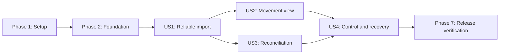

# Tasks: Holded Bank Movements

**Input**: Design documents from `/specs/20260916-holded-bank-movements/`

**Prerequisites**: [plan.md](./plan.md), [spec.md](./spec.md),
[research.md](./research.md), [data-model.md](./data-model.md),
[contracts/](./contracts), and [quickstart.md](./quickstart.md)

**Tests**: Automated tests are required by the specification, plan, and constitution. Write each
story's tests first and confirm they fail for the intended reason before implementing that story.
All Holded fixtures must be synthetic and must not contain values copied from production.

**Organization**: Tasks are grouped by user story so each increment has an explicit independent
test. Shared schema, authorization, and test infrastructure are isolated in the first two phases.

## Format: `[ID] [P?] [Story] Description`

- **[P]**: Can run in parallel because it changes different files and has no dependency on another
  incomplete task in the same phase.
- **[Story]**: Maps the task to one user story from [spec.md](./spec.md).
- Every task names the exact file or files it changes.

## Phase 1: Setup (Shared Test Infrastructure)

**Purpose**: Establish privacy-safe fixtures used to drive the provider and database contracts.

- [X] T001 [P] Create synthetic account, movement, and cursor-page fixture builders with production-value sentinels in `tests/helpers/holded-treasury.ts`
- [X] T002 [P] Create real-PostgreSQL banking fixture factories and deterministic cleanup helpers in `tests/helpers/banking.ts`

---

## Phase 2: Foundational (Blocking Prerequisites)

**Purpose**: Add the persisted invariants and shared trust-boundary code needed by every story.

**CRITICAL**: No user story implementation begins until this phase passes against PostgreSQL.

- [X] T003 Add failing PostgreSQL catalog/raw-SQL migration tests that compile before Prisma generation and cover all five banking models, five enums including provider-request rejection, account-scoped movement uniqueness, amount/direction and incident-position checks, account retention-floor and run-exhaustion fields, one active account, one nonterminal run, and nullable unique payment linkage in `tests/integration/bank-sync.test.ts`
- [X] T004 Add the five banking models and enums, account retention floor, and `Payment.bankMovementId` to `prisma/schema.prisma`, create the additive checks, partial unique indexes, foreign keys, and ordinary indexes in `prisma/migrations/20260916000000_holded_bank_movements/migration.sql`, then regenerate the Prisma client from `prisma/schema.prisma`
- [X] T005 [P] Define shared Zod schemas, limits, run-state sets, current two-decimal EUR ingestion rules, ISO-shaped retained currency/date validation, and action/filter input types in `src/modules/banking/schema.ts`
- [X] T006 [P] Implement database-backed operator/administrator authorization helpers for banking pages and actions in `src/modules/banking/authorization.ts`

**Checkpoint**: Prisma validates and generates, the migration applies to an existing booking
database without a backfill, and the new database constraints fail closed.

---

## Phase 3: User Story 1 - Import Reliable Bank Movements (Priority: P1) MVP

**Goal**: An administrator can select a verified Holded treasury account and Bereius can import every
advertised movement page into a minimal, exact, account-scoped read model without duplicates.

**Independent Test**: Configure an account against synthetic multi-page responses, run the importer
twice with new, unchanged, corrected, and malformed items, and verify one row per account/provider
ID, exact direction and money, sanitized incidents, page-atomic cursors, and six-hour due scheduling.

### Tests for User Story 1

- [X] T007 [P] [US1] Add failing Holded treasury client contract tests for account pagination, the exact bank-movements path, `start_date`, `limit=100`, opaque cursors, provider-order independence, response bounds, unknown-field stripping, status/transport-only sanitized failures with arbitrary opaque bodies, and the absence of treasury writes in `tests/unit/holded-treasury-client.test.ts`
- [X] T008 [P] [US1] Add failing movement parser tests for 24-hex identity/account checks, ISO-offset bank dates, exact two-decimal EUR-to-BigInt conversion, non-EUR rejection, sign-only direction, optional narrative/status/value date, zero rejection, and text-independent classification in `tests/unit/bank-movement-parser.test.ts`
- [X] T009 [P] [US1] Add failing administrator-only treasury selection tests for fresh provider options, archived/non-EUR account rejection, 90-day default, immutable historical start dates, credential reuse, and operator denial in `tests/unit/bank-account-settings.test.tsx`
- [X] T010 [US1] Extend the real-database scenarios in `tests/integration/bank-sync.test.ts` to cover account switching, complete page exhaustion, page rollback before cursor advance, idempotent repeats, update-in-place corrections, valid-plus-invalid mixed pages, exact counters, six-hour due scheduling, and preservation of historical account scopes

### Implementation for User Story 1

- [X] T011 [US1] Extend the existing authenticated Holded transport with minimal paged `listTreasuryAccounts` and `listBankMovements` reads, strict success envelopes, 15-second timeout, 1 MiB body limit, and transport/HTTP-status error mapping that discards opaque bodies in `src/lib/holded/client.ts`
- [X] T012 [US1] Implement two-decimal EUR movement normalization, exact signed minor-unit parsing, bank-calendar-date extraction, optional single-narrative/status handling, sign-only direction, and sanitized incident classification in `src/modules/banking/services/movements.ts`
- [X] T013 [US1] Implement fresh provider-backed eligible-EUR account selection, one-active-account switching, 90-day default calculation, immutable first-run start dates, and historical account preservation in `src/modules/banking/services/accounts.ts`
- [X] T014 [US1] Implement durable run creation/claiming and the complete order-independent page loop with a frozen configured-or-retention-floor `start_date`, account-scoped upserts, per-item incidents, one short transaction per page, post-commit cursor advancement, counters, clean exhaustion, and redacted structured events in `src/modules/banking/services/synchronization.ts`
- [X] T015 [US1] Implement the administrator-only treasury account Server Action with server-derived identity, fresh non-archived EUR option revalidation, trusted provider name/currency, first-run enqueue, route revalidation, and sanitized result states in `src/modules/banking/actions/settings.ts`
- [X] T016 [US1] Build the accessible treasury account selector and immutable-start-date states without exposing the credential in `src/modules/banking/components/treasury-account-settings.tsx`
- [X] T017 [US1] Integrate the banking-owned selector into the existing administrator integrations view while preserving its current authorization and Holded credential form in `src/app/[locale]/(console)/bookings/settings/page.tsx`
- [X] T018 [US1] Add matching English, Spanish, and Catalan account-selection, validation, incident, and import-state messages in `src/messages/en.json`, `src/messages/es.json`, and `src/messages/ca.json`
- [X] T019 [US1] Register the one-minute banking sweep and atomic six-hour due-run creation in `src/modules/booking/services/scheduler.ts` without adding a process, timer overlap, provider call inside a request, or new runtime configuration

**Checkpoint**: US1 passes the focused client/parser/account/import tests and can import a complete
synthetic account repeatedly while preserving exact data and a safe progress boundary.

---

## Phase 4: User Story 2 - Find and Understand Movements (Priority: P1)

**Goal**: Authorized staff can inspect retained movements, combine all supported filters, and trust
income/expense totals calculated over the complete filtered set and separated by currency.

**Independent Test**: Load more than 50 movements spanning accounts, dates, directions, currencies,
statuses, and optional narratives; exercise each filter alone and together and verify deterministic
rows, full-result totals, neutral missing values, private metadata, and accessible direction text.

### Tests for User Story 2

- [X] T020 [P] [US2] Add failing page/component tests for authentication, operator/admin access, localized callback redirects, `noindex`, loading/empty states, filter validation/reset, pagination, neutral optional values, and non-color direction semantics in `tests/unit/bank-movements-page.test.tsx`
- [X] T021 [P] [US2] Extend `tests/integration/bank-sync.test.ts` with failing PostgreSQL query tests for AND-combined direction/date/account/currency/case-insensitive narrative filters, inclusive dates, stable 50-row pages, retained account scopes, and full-filter totals grouped by currency and direction; any non-EUR rows are query-only fixtures, not accepted provider payloads
- [X] T022 [P] [US2] Add failing operator/admin bank-movement navigation and role-filtering assertions in `tests/unit/console-sidebar.test.tsx`

### Implementation for User Story 2

- [X] T023 [US2] Implement authorized movement queries, deterministic date/provider-ID ordering, validated bounded filters, 50-row pagination, filter options, and exact grouped BigInt totals in `src/modules/banking/services/queries.ts`
- [X] T024 [US2] Add complete English, Spanish, and Catalan movement, filter, total, pagination, empty, and validation copy in `src/messages/en.json`, `src/messages/es.json`, and `src/messages/ca.json`
- [X] T025 [P] [US2] Build URL-backed direction/date/account/currency/text filters that reset the page and remain keyboard accessible in `src/modules/banking/components/movement-filters.tsx`
- [X] T026 [P] [US2] Build the responsive semantic movement table with stable dimensions, signed amounts, localized textual direction, concept/reference projection, and neutral optional values in `src/modules/banking/components/movement-table.tsx`
- [X] T027 [P] [US2] Add a stable, localized loading presentation for the private route in `src/app/[locale]/(console)/bank-movements/loading.tsx`
- [X] T028 [US2] Implement the authenticated Server Component with async Next.js route inputs, validated URL state, direct query-service calls, totals, pagination, safe invalid-filter handling, and `noIndexMetadata` in `src/app/[locale]/(console)/bank-movements/page.tsx`
- [X] T029 [US2] Add the localized Bank movements destination to the operator/admin Holded navigation section in `src/modules/console/navigation.ts`

**Checkpoint**: US2 can be tested with only stored synthetic movements; it needs no live Holded call
and sends neither unbounded records nor BigInt values directly to the browser.

---

## Phase 5: User Story 3 - Reconcile Booking Payments (Priority: P1)

**Goal**: Only exact eligible income movements create review proposals, and an operator explicitly
confirms or dismisses each proposal through the existing payment, lifecycle, audit, and mail paths.

**Independent Test**: Present equal income and expense movements plus near matches for one
awaiting-payment booking; verify only the exact income proposes and that confirmation creates one
payment/state/audit outcome atomically while dismissal and replay remain inert.

### Tests for User Story 3

- [x] T030 [P] [US3] Add failing real-database matching tests for positive income, `EUR`, literal estimate number, exact advance-plus-deposit amount, expense exclusion, missing reference, near/partial/combined/overpayment exclusion, durable dismissal, corrections, and proposal idempotency in `tests/integration/bank-reconciliation.test.ts`
- [x] T031 [P] [US3] Add failing regression tests proving both manual and movement-backed payment creation roll back with stale booking state and produce one payment, transition, audit event, and post-commit mail on success, including bank-calendar-date to canonical `receivedAt` and narrative to nullable `reference` mapping, in `tests/integration/booking-decisions.test.ts`
- [x] T032 [P] [US3] Extend `tests/unit/bank-movements-page.test.tsx` with failing pending/confirmed/dismissed/invalidated proposal rendering, confirm/dismiss action states, safe not-found behavior, announcements, and double-submit prevention

### Implementation for User Story 3

- [x] T033 [US3] Refactor the existing strict payment operation into a transaction-aware trusted helper while preserving the manual payment action and moving payment creation plus `transitionBooking(..., tx)` into one transaction in `src/modules/booking/services/decisions.ts`
- [x] T034 [US3] Implement exact proposal generation, revalidation, conditional confirmation, unique movement-to-payment linking, BigInt-to-existing-Int range checks, dismissal, sibling invalidation, and confirmed-correction incidents in `src/modules/banking/services/reconciliation.ts`
- [x] T035 [US3] Invoke proposal creation/invalidation inside each committed movement page without making a provider correction auto-reverse a confirmed decision in `src/modules/banking/services/synchronization.ts`
- [x] T036 [US3] Implement operator-authorized confirm and dismiss Server Actions that accept only a local proposal ID, derive every trusted value server-side, revalidate current state, queue mail after commit, and return sanitized unions in `src/modules/banking/actions/reconciliation.ts`
- [x] T037 [US3] Add complete English, Spanish, and Catalan proposal, decision, stale-state, and confirmation messages in `src/messages/en.json`, `src/messages/es.json`, and `src/messages/ca.json`
- [x] T038 [US3] Build accessible proposal summaries and confirm/dismiss forms with pending locks and live result announcements in `src/modules/banking/components/reconciliation-actions.tsx`
- [x] T039 [US3] Integrate authorized proposal context and actions into each eligible movement row without exposing customer identity or trusted financial fields in `src/app/[locale]/(console)/bank-movements/page.tsx`

**Checkpoint**: US3 proves that expenses and near matches never propose, no booking changes without a
human decision, and concurrent confirmation cannot create a duplicate or partial outcome.

---

## Phase 6: User Story 4 - Control and Recover Synchronization (Priority: P2)

**Goal**: Authorized staff can request one durable refresh, see accurate progress and failure state,
retry safely, and prevent unpaid expiry whenever fresh complete bank evidence is unavailable.

**Independent Test**: Exercise concurrent triggers, interruption after a committed page, lease
expiry, rate limiting, malformed/missing/repeated cursors, retry exhaustion, and provider outage;
verify one effective run, safe resume, honest partial/failed states, retained rows, and deferred
booking expiry.

### Tests for User Story 4

- [X] T040 [US4] Extend `tests/integration/bank-sync.test.ts` with failing concurrency, conditional lease ownership, heartbeat/reclaim, bounded backoff, cooldown, stale-cursor restart, missing/repeated cursor, empty-nonterminal page, `PARTIAL` versus `FAILED`, manual retry, retained-row scenarios, and normal synthetic-provider visibility within two minutes of an accepted manual request
- [X] T041 [P] [US4] Add failing real-database expiry tests that capture the attempt start, reject older successful/in-flight runs, require a clean run whose first lease is at or after that boundary, and cover missing configuration, outage, retrying/partial/failed runs, concurrent booking changes, and pending-proposal deferral in `tests/integration/bank-expiry.test.ts`
- [X] T042 [P] [US4] Extend `tests/unit/bank-movements-page.test.tsx` with failing queued/running/retrying/succeeded/partial/failed progress, exact six-hour degradation boundaries, distinct unconfigured/initial-active states, latest-success freshness, sanitized incidents, polling cleanup, retry control, retained-data, and manual cooldown states
- [X] T043 [P] [US4] Add failing scheduler registration, non-overlap, graceful shutdown, due-run, daily retention registration, and isolated task-failure assertions in `tests/unit/instrumentation.test.ts`
- [X] T044 [P] [US4] Add failing real-database retention tests for first-run history, exhausted-run-only monotonic floor advancement including incident-only `PARTIAL`, incomplete partial/failed deferral, bounded old unmatched movement and dismissed/invalidated proposal deletion, protected payment/pending/confirmed records, 90-day terminal run/incident pruning, and no re-import after pruning in `tests/integration/bank-retention.test.ts`

### Implementation for User Story 4

- [X] T045 [US4] Complete lease recovery, six-attempt 30-second-to-one-hour backoff, heartbeat ownership, manual linked retry, stale-cursor page-one fallback, effective retention-floor windows, and progress-aware `PARTIAL`/`FAILED` transitions in `src/modules/banking/services/synchronization.ts`
- [X] T046 [P] [US4] Implement the operator/admin manual-refresh and explicit-retry Server Action with active-account lookup, one-effective-run behavior, one-minute database cooldown, route revalidation, and no inline provider work in `src/modules/banking/actions/synchronization.ts`
- [X] T047 [US4] Add complete English, Spanish, and Catalan refresh, progress, freshness, retry, partial/failure, expiry-deferral, degradation, retention-safe, and sanitized incident messages in `src/messages/en.json`, `src/messages/es.json`, and `src/messages/ca.json`
- [X] T048 [US4] Build the manual refresh control with disabled pending states, polite polling via `router.refresh()`, terminal stop/unmount cleanup, progress counters, freshness, and retry affordance in `src/modules/banking/components/synchronization-control.tsx`
- [X] T049 [US4] Extend the authorized page projection with the latest run, latest successful time, sanitized incidents, pending proposal count, retry eligibility, and stale/failed integration-degradation state in `src/modules/banking/services/queries.ts`
- [X] T050 [US4] Integrate the synchronization control and honest stale/partial/error/degraded presentations while preserving access to earlier rows in `src/app/[locale]/(console)/bank-movements/page.tsx`
- [X] T051 [P] [US4] Implement expiry orchestration that captures `expiryAttemptStartedAt`, rejects older successful/in-flight evidence, creates or waits for a clean `EXPIRY` run first leased at or after that boundary, rechecks booking/proposal state transactionally, and otherwise defers without mutation in `src/modules/banking/services/expiry.ts` and `src/modules/booking/services/expiry.ts`
- [X] T052 [P] [US4] Implement bounded daily cleanup with `exhaustedAt`-gated monotonic floor advancement, old unprotected movement/proposal deletion, payment and pending/confirmed proposal protection, and 90-day terminal run/incident pruning in `src/modules/banking/services/retention.ts`
- [X] T053 [US4] Wire retryable banking work, freshness-gated expiry, and daily retention into the existing non-overlapping scheduler with graceful shutdown and per-task failure isolation in `src/modules/booking/services/scheduler.ts`

**Checkpoint**: US4 exposes accurate durable progress and recovery to authorized users, while a
provider failure neither hides prior movements nor allows unsafe booking expiry.

---

## Phase 7: Polish and Cross-Cutting Verification

**Purpose**: Prove privacy, boundaries, production behavior, and forward recovery across all stories.

- [x] T054 [P] Add structured-log and incident-projection tests that reject credentials, provider IDs, cursors, dates, amounts, narratives, references, counterparties, raw bodies, and provider messages in `tests/unit/banking-observability.test.ts`
- [x] T055 [P] Extend server/client and domain dependency checks so banking UI cannot import Prisma, credentials, or server-only provider/services and no Enable Banking runtime/config source is introduced in `tests/unit/architecture-boundaries.test.ts`
- [x] T056 [P] Extend the existing server-process provider interception with dynamic Holded account/movement URL forwarding, preserved path/query, synthetic page/error controls, and request capture in `tests/e2e/helpers/provider-fetch-preload.mjs`, `tests/e2e/helpers/provider-http-fixture.ts`, and `scripts/test-e2e.sh`; do not add a production base-URL override
- [x] T058 [P] Extend shared SEO tests with explicit assertions that every localized bank-movements path is absent from generated sitemap entries, the page emits `noindex`, and robots permits HTML crawling while blocking the API family in `tests/unit/seo.test.ts` and `tests/unit/bank-movements-page.test.tsx`
- [x] T059 [P] Document Holded as the sole bank-movement source, current EUR-only ingestion, treasury configuration, six-hour scheduling, 90-day unmatched-data retention, redacted observability, provider-outage recovery, migration-first rollout, and the absence of new secrets/services in `README.md`, and mark the superseded Enable Banking design passages accordingly in `specs/20260909-project-specification/spec.md`
- [x] T060 Validate additive migration, previous-image compatibility, logical backup/restore boundaries, retention-floor behavior, and stale-cursor forward recovery against a disposable database by following `specs/20260916-holded-bank-movements/quickstart.md`

---

## Dependencies and Execution Order

### Phase Dependencies

- **Phase 1 - Setup**: No dependencies; T001 and T002 can run in parallel.
- **Phase 2 - Foundational**: Depends on Phase 1 and blocks every user story.
- **Phase 3 - US1**: Depends on Phase 2 and establishes the account, movement, run, and provider
  foundations used by all later stories.
- **Phase 4 - US2**: Depends on US1 persisted movements; it can proceed in parallel with US3.
- **Phase 5 - US3**: Depends on US1 persisted movements and booking documents; it can proceed in
  parallel with US2.
- **Phase 6 - US4**: Its synchronization controls depend on US1, its page integration depends on
  US2, and pending-proposal expiry deferral depends on US3.
- **Phase 7 - Polish**: Depends on every story selected for delivery.

### User Story Completion Order



### Within Each User Story

- Write the story's tests first and confirm each fails for the expected missing behavior.
- Complete provider/schema/service behavior before actions and UI that consume it.
- Keep external HTTP outside database transactions and commit a cursor only with its complete page.
- Re-run the narrow story tests after every implementation task that changes their behavior.
- Stop at the story checkpoint before starting a dependent phase.

## Parallel Opportunities

- **Setup**: T001 and T002 touch independent test helpers.
- **Foundation**: After T004 fixes the failing schema test, T005 and T006 can proceed independently.
- **US1**: T007, T008, and T009 can be authored in parallel; after T011, provider normalization and
  account service work can be split between T012 and T013.
- **US2**: T020, T021, and T022 can be authored in parallel; after T023 and T024, T025, T026, and
  T027 touch independent UI files.
- **US3**: T030, T031, and T032 can be authored in parallel; service work remains ordered because
  proposal confirmation depends on the transaction-aware booking boundary.
- **US4**: T040 through T044 can be authored in parallel; after T045, the manual action, expiry
  orchestrator, and retention service can be implemented in separate files before scheduler
  integration.
- **Polish**: T054 through T056 and T058 through T059 touch separate verification/documentation
  surfaces; T057 depends on the provider-fixture extension in T056.

## Parallel Examples

### User Story 1

```text
Task: "T007 Holded treasury client contract tests in tests/unit/holded-treasury-client.test.ts"
Task: "T008 movement parser tests in tests/unit/bank-movement-parser.test.ts"
Task: "T009 account settings tests in tests/unit/bank-account-settings.test.tsx"
```

### User Story 2

```text
Task: "T020 page and accessibility tests in tests/unit/bank-movements-page.test.tsx"
Task: "T021 query and totals tests in tests/integration/bank-sync.test.ts"
Task: "T022 navigation tests in tests/unit/console-sidebar.test.tsx"
```

### User Story 3

```text
Task: "T030 reconciliation contract tests in tests/integration/bank-reconciliation.test.ts"
Task: "T031 atomic payment regression tests in tests/integration/booking-decisions.test.ts"
Task: "T032 proposal UI tests in tests/unit/bank-movements-page.test.tsx"
```

### User Story 4

```text
Task: "T040 run recovery tests in tests/integration/bank-sync.test.ts"
Task: "T041 expiry freshness tests in tests/integration/bank-expiry.test.ts"
Task: "T042 progress UI tests in tests/unit/bank-movements-page.test.tsx"
Task: "T043 scheduler tests in tests/unit/instrumentation.test.ts"
Task: "T044 retention tests in tests/integration/bank-retention.test.ts"
```

## Implementation Strategy

### MVP First: User Story 1

1. Complete Phase 1 fixture infrastructure.
2. Complete Phase 2 schema, constraints, validation, and authorization.
3. Complete US1 provider reads, account configuration, durable import, incidents, and six-hour due
   scheduling.
4. Stop and run the US1 checkpoint against synthetic responses and real PostgreSQL.
5. Treat this as a technical MVP; production reconciliation still requires US3, and safe operator
   recovery plus expiry requires US4.

### Incremental Delivery

1. **Foundation + US1**: Establish a complete, idempotent, minimal local bank read model.
2. **US2**: Deliver private staff visibility and exact filtered totals without changing bookings.
3. **US3**: Enable strict human-reviewed payment reconciliation on the proven movement data.
4. **US4**: Add manual control, transparent recovery, and the payment-aware expiry safety gate.
5. **Polish**: Prove privacy, architecture, migration/recovery, and production-artifact behavior.

Each checkpoint is independently demonstrable. No increment permits a provider write, automatic
booking confirmation, cross-currency total, raw payload retention, or movement-derived expense
category.